+++
date = '2023-12-30'
draft = false
title = 'Avoid UGREEN Products!'
+++

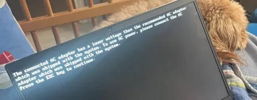

## Update, 12/20/25

In the time since I've posted this, I worked at Salem Techsperts for about a year.
I've found that UGREEN is actually a moderately reputable brand, and I just got unlucky getting a defective unit. Additionally, Mozilla FakeSpot no longer exists. In fact, at this time, my main charger cable (not brick) is a UGREEN USB C cable.

**With that being said, I cannot in good faith claim all the statements here are reliable. There is a chance that since Salem Techsperts was sponsored by UGREEN, they cherry picked good units however, so I would still be weary and research the products you buy.**

---

Ever since watching [one of Louis Rossmann's videos on bad Amazon sellers](https://www.youtube.com/watch?v=DiKflg8Uko4), I decided I'd try to buy less from random Chinese sellers and buy more reliable products from name brand companies.



Louis Rossmann explains how dangerous and poorly made products from China are overtaking quality products on Amazon.

Recently, I tripped over my laptop cable and broke the USB C end off of it. I was in need of a USB C charger. I had recently been watching a lot of videos from [Salem Techsperts](https://www.youtube.com/c/salemtechsperts) and saw they were recently sponsored by UGREEN with some power bricks. I decided I'd try purchasing from UGREEN thinking the quality would be good, and he would get whatever percent he gets when someone buys using the affiliate link.



Andy from Salem Techsperts explaining how he replaced his mess of chargers with a single UGREEN 100 watt power brick.

I want to stress this is in no way his fault. There are several things that could be going on here.

- Andy could have gotten a specially made review unit
- I could have gotten a defective product

I decided not to buy a second one to check if this happens across the board, as I'm not a professional reviewer. I just want a working charger for my laptop.

I should mention my laptop is a ThinkPad E14 Gen 2, which takes a 65 watt input. The charger I bought from UGREEN is a 100 watt power brick.
Specifically the [UGREEN 4 port Nexode GaN 100W Power Brick](https://www.amazon.com/dp/B091Z6JNX4). Despite the power brick being 100 watts (above and beyond the 65 watt requirement) I was met with various problems charging.

These problems ranged from charging at half the speed of a Steam Deck 45 watt charging brick to not charging at all.
The first thing that immediately struck me as weird was when a device is plugged into it, it will often reconnect once or twice, which is not a thing that happens with any of the prior USB C charging bricks I've used in the past. This happened on my laptop (65W) and even my iPhone MagSafe. (15W)

If the 100W charging brick cannot properly handle a 15W device, that is an astonishing design flaw.

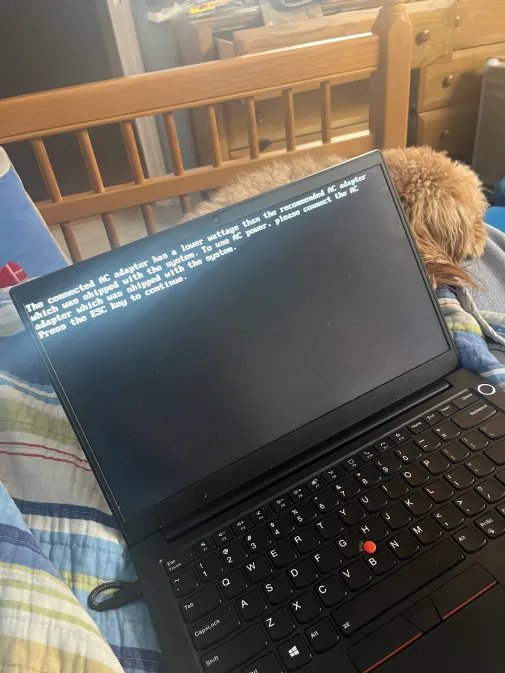

Below are a few screenshots of charging my laptop with various devices at varying wattage.

## [UGREEN 100 Watt Charger](https://www.amazon.com/dp/B091Z6JNX4)

UGREEN's charging speed was extremely inconsistent, but in almost every case extremely slow. Keep in mind, this is a 100 watt power brick charging a device that requires 65.

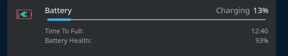

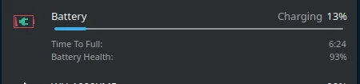

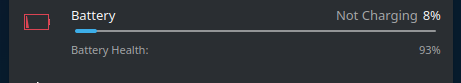

## [Steam Deck 45 Watt Charger](https://www.ifixit.com/products/steam-deck-and-steam-deck-oled-ac-adapter-us)

The charger that came with the Steam Deck always outperformed the 100 watt charger, despite having 55% less output.

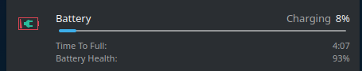

## [Apple 20 Watt Charger](https://www.apple.com/shop/product/mwvv3am/a/20w-usb-c-power-adapter)

The 20 watt charger that Apple uses for phone and watch charging generally offered the same charge speed as the 100 watt charger from UGREEN. I think this says a lot about the UGREEN charger.

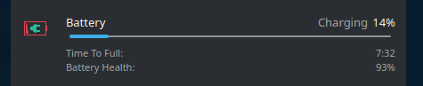

## [Anker 65 Watt Charger](https://www.amazon.com/gp/product/B08T5QN2TR)

Out of the box, it immediately strikes me that this is a very dense and small charger. Regardless, letting my laptop drain to 12% for the tests again reveals amazing and fairly consistent (+/-20 minutes) charging times.

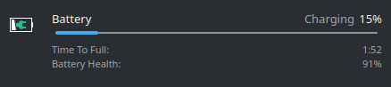

The screenshots were all made using a certified 100W USB C PD cable from a reputable brand. (Anker) The exception being the Steam Deck charger, which has its cable permanently attached to the brick.

I intend to update this post at some point using one of [Apple's 100 watt MacBook chargers](https://www.apple.com/shop/product/mw2l3am/a/96w-usb-c-power-adapter), to actually get a proper 100W comparison. Even without it, I think I've made my point here.

## Why are all the Amazon reviews so good?

If you've watched Louis Rossmann's video (linked earlier) this should make sense. regardless, we can still talk about it.

### Update: As of July 1st 2025, FakeSpot has been shutdown

[Mozilla has created FakeSpot, an AI powered tool for analyzing fake reviews on products](https://blog.mozilla.org/en/mozilla/building-whats-next/). Across the board, You can see a poor FakeSpot grade on most products from UGREEN, which usually indicates review tampering.

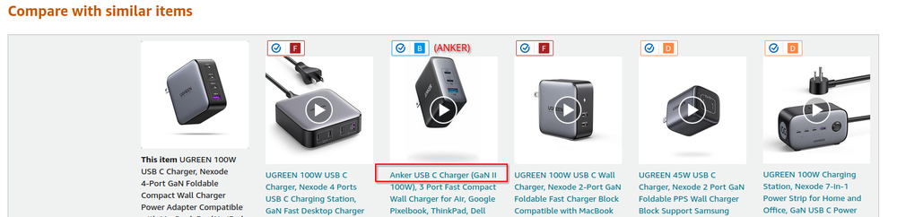

You can check out the FakeSpot result page of the 100W charger I bought below. As of time of writing it has a C.

[Included here was a link to the FakeSpot page for this device, which no longer exists]

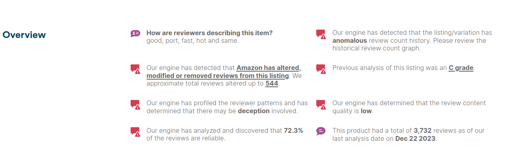

On the other hand, you can see much better grades on brand name products which there are not many of, as both [Amazon Brand Filter](https://github.com/chris-mosley/AmazonBrandFilter) (An extension to remove no-name brands from amazon results) and FakeSpot are filtering the page.

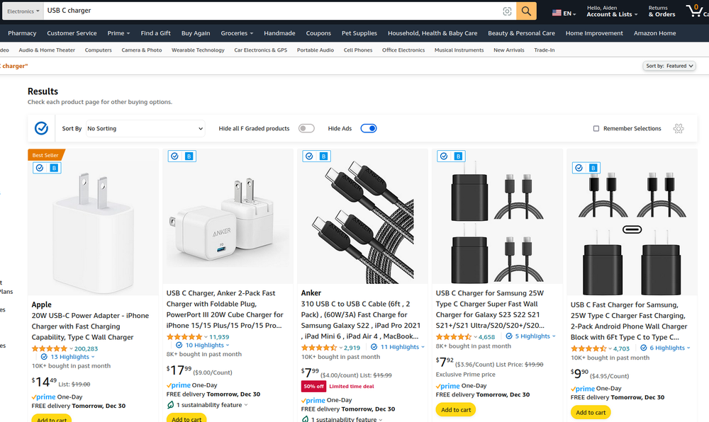

Of course, I don't blame you if you don't believe the arbitrary ratings of this tool you probably just heard of.
Let's go to Reddit instead!

Within Reddit, there is a small community of people passionate about USB C technology at [r/UsbCHardware](https://www.reddit.com/r/UsbCHardware/). What do they have to say about UGREEN?

Apparently, in the past UGREEN has had a down right horrid reputation in the subreddit. However, apparently their quality has gotten better, but members in the subreddit still advise against UGREEN.

A few of the pain points about the UGREEN chargers for the members of the subreddit are as follows:

### Some of their chargers do not have safety ratings in the US

With that being said, upon inspecting my charger I got from UGREEN, neither the packaging nor the brick itself have any sort of UL or ETL certification logo. You can find one of these logos on just about anything that plugs into the wall.

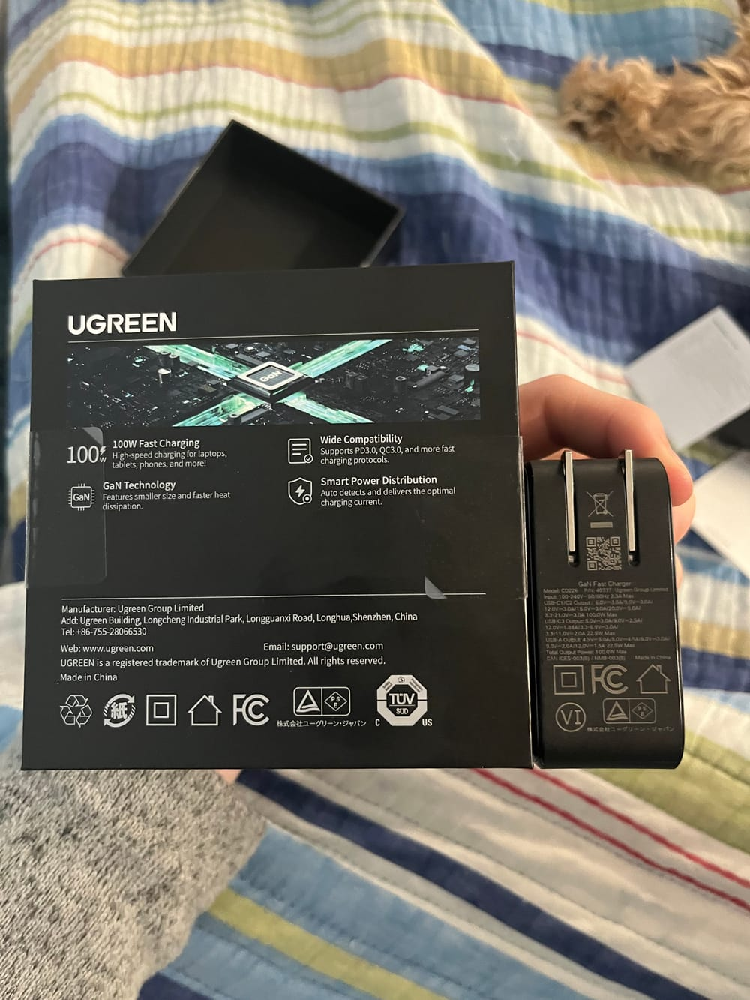

There is also a post with a massive run down of deceptive specifications on their chargers, but it's about 3 years old at time of writing, so I'm not really taking it into account. [You can check it out if you want though.](https://www.reddit.com/r/UsbCHardware/comments/j29agr/ugreen_65w_3c1a_beware/)

Apparently at one point, the subreddit even had a warning against UGREEN specifically in the sidebar, but this seems to be a relic of the past [from a post about 2 years old](https://www.reddit.com/r/UsbCHardware/comments/qx8bfc/is_ugreen_good_i_am_considering_their_3c1a_100/).

Overall, from the subreddit it seems to be a vague "no" according to a [more recent post](https://www.reddit.com/r/UsbCHardware/comments/13v321u/ugreen/).

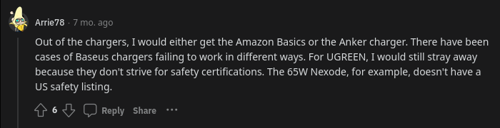
