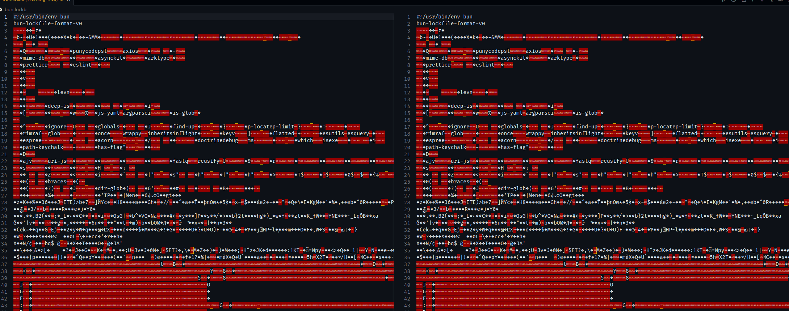

+++
date = '2024-04-13'
draft = false
title = "My Gripes with Bun's Binary Lockfile"
+++

This isn't a deep dive into the workings of Bun, and I haven't worked with it at all really. This is just my opinion on it after stumbling across a project that uses it, and playing with it a bit.

The project I'm gonna be referencing its usage in [YTMusic API by Zechariah](https://github.com/zS1L3NT/ts-npm-ytmusic-api/)

First thing I do is `bun install` which seems to update the lockfile for whatever reason.
Sometimes this is normal. Lets take a look.

Oops! It's a binary file.

Bun claims this is to increase the speed of operations. Maybe it does. I haven't personally benchmarked it. Bun is damn fast nonetheless.

|      | PNPM   | NPM    | BUN    | PNPM (--no-lockfile) |
|------|--------|--------|--------|----------------------|
| Time | 1.931s | 6.568s | 0.079s | 1.721s               |

I know PNPM and (probably) Bun have caches somewhere. I have not cleared those for these tests. I removed `node_modules` and the respective lockfile before each test

I'm not sure how much having a binary file over JSON contributes to this. I kinda doubt it matters that much frankly, but I could be entirely wrong. This is just a lot of speculation.

in a best case scenario, lets assume using the binary file saves 500ms somehow. Perhaps this is a hot take, but I don't think that's a reasonable trade-off for human readable files. Especially [given the recent XZ debacle](https://boehs.org/node/everything-i-know-about-the-xz-backdoor).

Due to the file's binary nature, there's a lot you could hide in there. The *normalization* of a binary file being in a repo is what I think is concerning. people will overlook it more often just because the file is generally for bun. XZ's payload was achieved by embedding it into the test archives. You could insert a malicious payload into a `bun.lockb` file, and say it's just there because you use bun locally.

A bit of a stretch, but its clearly possible as demonstrated by the XZ backdoor.

I know bun offers a lot of other cool features which I haven't tried, but this has been my biggest gripe, a lockfile people can't interpret.

There's been some [discussion about it on GitHub](https://github.com/oven-sh/bun/issues/5486) where some solutions proposed having both a binary and text lockfile. I think this is quite acceptable, but they don't seem interested in implementing something like that.

If this were to happen I would just commit only the text version, and gitignore the binary file, treating it similar to a build artifact.
