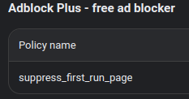

+++
date = '2023-12-08'
draft = false
title = 'Disable AdBlock Plus first run popup using suppress_first_run_page'
+++



## This is pretty quick and easy

```json
{
  "supress_first_run_page": {
    "Value": true
  }
}
```

*Spaces, newlines, and tabs do not matter. Capitalization does.*
[More details on this process are here](https://www.chromium.org/administrators/configuring-policy-for-extensions/), and [how to get to extension settings is here](https://support.google.com/chrome/a/answer/2657289?sjid=7506363994231679902-NA#apps)
Why this exists? No documentation on disabling AdBlock Plus' first run page exists. I believe this is maliciously intentional.

### On a tangent, did you know its AdBlock plus is practically useless anyway? [They've been bribed by almost every major advertiser to whitelist their ads.](https://www.businessinsider.com/google-microsoft-amazon-taboola-pay-adblock-plus-to-stop-blocking-their-ads-2015-2)

### [Deploy uBlock Origin for better control over your organization's ad blocking policies.](https://github.com/gorhill/uBlock/wiki/Deploying-uBlock-Origin)
