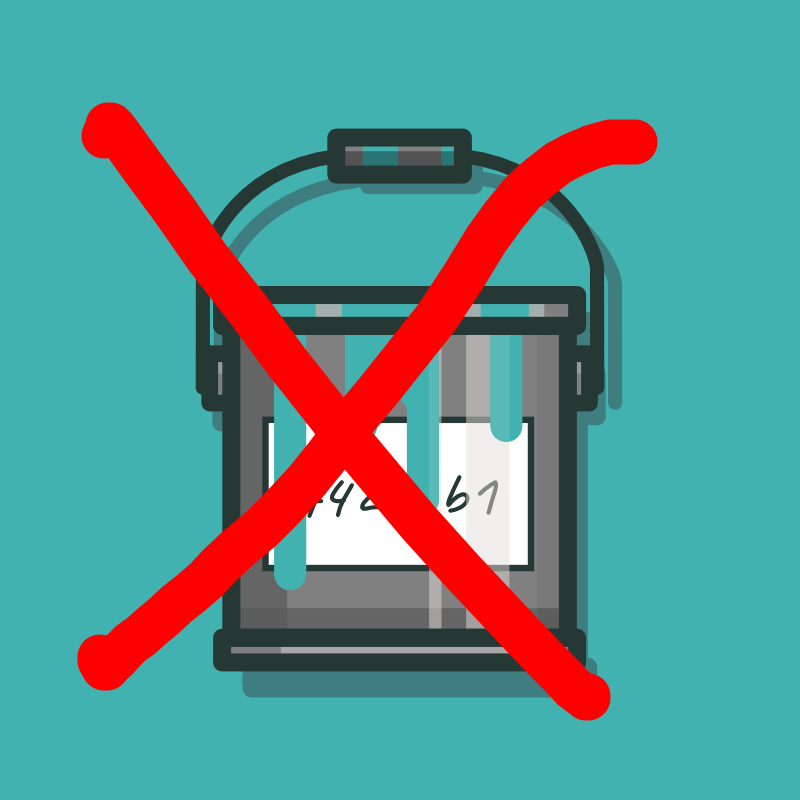
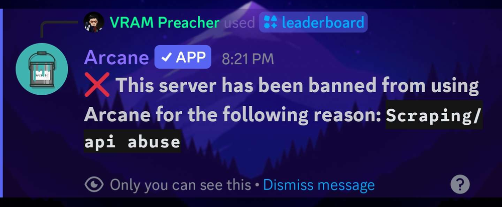

+++
date = '2025-04-17'
draft = false
title = "Exporting data from Arcane Bot"
+++



The Arcane Discord bot (often used for leveling in servers) offers no way to export level data for switching to another bot.

It's quite simple, in a round-a-bout way.

Don't tell anyone from Arcane, or they will ban you, but otherwise, ***they have no way of telling ;)***



## Why?

I wanted to switch Discord bots for level roles. Specifically to <https://xela.dev/> (Amazing team, by the way)

Turns out, Arcane has no way of requesting data for your server. So, I decided to take it into my own hands.

## How?

Arcane has a leader board for viewing top levels online. This will be our data source.

The site is reactive, and you cannot save the HTML and get the data too.
So, we need to run a script in the console, to make it easy.

Full disclaimer, I used Google Gemini to put this code together, as I am simply lazy, and [don't wanna parse HTML with RegEx](https://stackoverflow.com/questions/1732348/regex-match-open-tags-except-xhtml-self-contained-tags).

Anyway, into the fun stuff.

I wanted to convert this data from HTML to a JSON, following the structure the [Lurkr Discord bot](https://lurkr.gg/docs/guides/exporting-leveling-leaderboard) uses. Mainly, because it works with Xela's import function. Nonetheless, it is a simple format.

```ts
interface Level {
    avatar: string | null;
    level: number;
    messageCount: number;
    tag: string | null;
    userId: string;
    xp: number;
}

interface Export {
    levels: Level[];
}
```

Upon inspecting the source code for the online leaderboard, I found that "entries" generally follow the following format:

```html
<div class="box box-hover" style="margin-bottom: 10px;">
    <div style="display: flex; gap: 10px; align-items: center;" class="has-text-centered">
        <h1 class="is-size-5 has-text-weight-semibold" style="color: rgb(255, 255, 255);">6. </h1>
        <figure class="image"></figure>
        <p class="has-text-white is-size-5 has-text-weight-semibold">@someaspy</p>
        <div style="flex-grow: 2;"></div>
        <p class="has-text-white is-size-5 has-text-weight-semibold" style="min-width: 50px; max-width: 50px;">67</p>
        <p class="has-text-white is-size-5 has-text-weight-semibold hide-mobile"
            style="min-width: 100px; max-width: 100px;">232.7K</p>
        <p class="has-text-white is-size-5 has-text-weight-semibold" style="min-width: 50px; max-width: 50px;">20.2K</p>
        <p class="has-text-white is-size-5 has-text-weight-semibold hide-mobile"
            style="min-width: 50px; max-width: 50px;">-</p>
        <p class="has-text-white is-size-5 has-text-weight-semibold hide-mobile"
            style="min-width: 50px; max-width: 50px;">-</p>
    </div>
</div>
```

This is workable.

```html
  <h1 class="is-size-5 has-text-weight-semibold" style="color: rgb(255, 255, 255);">6. </h1>
```

The next meaningful part of the HTML is the profile picture:

```html
<figure class="image">
  
</figure>
```

from this, we can extract the profile picture itself, and the user ID, `516750892372852754` in my case.

The next piece of data is the user's handle:

```html
<p class="has-text-white is-size-5 has-text-weight-semibold">@someaspy</p>
```

and then, we have some seemingly unlabeled numbers.

```html
<p class="has-text-white is-size-5 has-text-weight-semibold"
   style="min-width: 50px; max-width: 50px;">
    67
</p>
<p class="has-text-white is-size-5 has-text-weight-semibold hide-mobile"
   style="min-width: 100px; max-width: 100px;">
  232.7K
</p>
<p class="has-text-white is-size-5 has-text-weight-semibold"
   style="min-width: 50px; max-width: 50px;">
  20.2K
</p>
```

In order of appearance, `67` is the user's actual level. `232.7K` is the amount of XP the user has, and then `20.2K` is the message count.

```json
{
  "avatar": "ad85e1d3cfd20968ef993a520d8c251f",
  "level": 67,
  "messageCount": 20200,
  "tag": "someaspy",
  "userId": "516750892372852754",
  "xp": 232700
}
```

And that's about it!

Using the script is super easy too:

1. Load all leaderboard entries (anything not loaded will not be captured!)
2. Run the script
3. Copy the output

<https://gist.github.com/SomeAspy/2b27a6d66b97db6bd1b62afac5343285>

However, the free tier of Arcane only shows up to 100 users on the leaderboard.
Without looking too much into it, I didn't see a way around this.
I just coughed up the $5.75 to get premium, and then loaded the entire leaderboard. **Afterward, make sure you cancel it, and request a refund.**

## Pitfalls

If a user is not in the server, their profile picture will not be cached.
Thus, there is no way to get their ID or avatar. for simplicity, we simply skip over these users. This also probably (???) applies to users with the default avatar. I haven't checked.

## TLDR

1. Load all leaderboard entries on the online leaderboard (You can get a link to it using /leaderboard in your Discord server with Arcane Free tier is limited to 100 entries. Pay, cancel, and refund if you need to.
2. Run the script (<https://gist.github.com/SomeAspy/2b27a6d66b97db6bd1b62afac5343285>) in the browser console.
3. Copy and save JSON output.

There is no way for Arcane to detect this, but if you directly tell them what you are doing you will get banned!

Good luck! If you decide to go with Xela, mention my blog post!

### P.S: Fuck you Arcane staff team ❤️

### P.P.S: If my script doesn't work anymore, just go into the developer menu (usually F12) and copy paste the HTML into chatgpt or gemini, and ask it to make a script. Yeah, I hate AI, but I also hate monotonous work and lock-in
