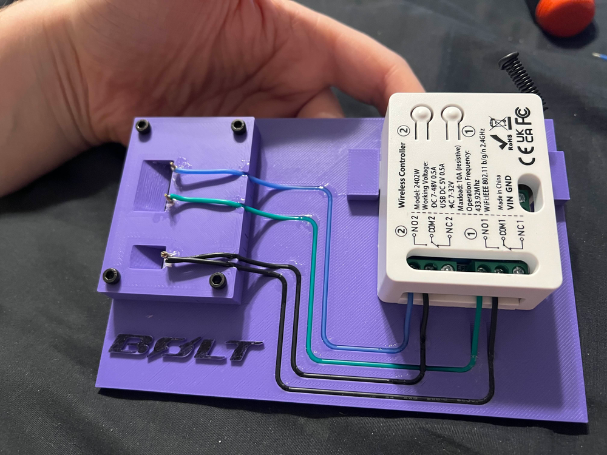

+++
date = '2025-12-20'
draft = false
title = 'I'm a bitch to big tech'
+++

BEWARE: This is totally gonna be a kinda "old man yells at cloud" post. It's gonna be totally unstructured and messy.

In the past decade or so tech has gotten much more advanced, but paradoxically worse at the same time, in my opinion.
My first phone was the iPhone 5s. Nice little brick that got the job done. I don't remember exactly when hardware became more eh. iPhone 8 maybe? For software? maybe since the early days of Windows 10. 2015, or 2016? Back when they started telling Windows 7 users to update.

Things are just so god-damned locked down and there's nothing I can do about it. I've switched to Android and Linux, and I still like feel like I'm a bitch to big tech.

## Example 1: Android's Bitch

Recently, I've switched my Google Pixel 8's launcher from the stock to [Lawnchair](https://github.com/LawnchairLauncher/lawnchair). Reason was simply because I want the search bar at the bottom of my screen to open in Firefox instead of Chrome. I've found there's some odd behavior though. Apparently a while back Google put the launcher, app switcher, and couple other things into the same system app, and offer no good interfaces for external applications to hook into that well. I don't know the exact details but it introduces hiccups into the process of switching from app switcher to home screen, unlocking, etc.
So then, I consider switching to [GrapheneOS](https://grapheneos.org/) so I'm not getting these hurdles to making things the way I want them, **but apparently that will disable all tap-to-pay and some "secure" apps (Banking mainly) won't work, because the device is not "Google Play Certified" at that point.** God Dammit.

## Example 2: GM's Bitch

A few months ago, I got a nice [2022 Chevrolet Bolt EUV](https://news.chevrolet.com/newsroom.detail.html/Pages/news/us/en/2021/feb/0214-boltev-bolteuv-specifications.html). All electric vehicle, I love it. BUT, a few things. The OBD-II port is **read-onl**y. There is a dedicated firewall between the OBD port and the car computer. This is called Global A. It's a predecessor to Global B (mentioned later) which doesn't encrypt the the CAN bus but locks it down more, and adds parts pairing. Secondly, OnStar. OnStar is a service that lets you remotely monitor/control certain functions of your car over the internet. For example: remote start, door locks, windows, location, whatever. It's a subscription based service. Understandable, there's cellular fees, server costs, development costs, all that fun stuff. It's still not my thing though. So after my free month from buying the car I don't resubscribe. The only thing I really care about is remote start. (or starting the climate control for EVs) I can do this from my keyfob, but it's distance is limited and I can't really interface with it to make a schedule or anything.
At that point, you are shit outta luck. The communications between the OnStar module and the main car computer are crypto-graphically signed. [In fact, in newer GM vehicles, the entire CAN bus is encrypted (Global B)](https://gmauthority.com/blog/gm/general-motors-technology/gm-infotainment-technology/global-b/). So that essentially kills any [cool modifications like Comma.ai self driving](https://comma.ai/).
Someone devised this contraption that uses a dismantled physical keyfob and connects it to a raspberry pi or whatever to add a lot of OnStar features for a one time purchase of like 20 or 30 bucks worth of parts.

I don't have a link for it at the time of writing because its kinda being prototyped or whatever but its cool. Still shitty that hacks like this have to be performed at all on something I "own"

[I also disconnected the physical antenna for the OnStar module](https://www.reddit.com/r/BoltEV/comments/16h91a6/i_made_a_step_by_step_guide_to_disable_onstar_on/), because I don't want them tracking my shit if I'm not getting anything out of it. [OnStar got in trouble a few early 2025 for selling driver's driving habits to insurance agencies](https://www.ftc.gov/news-events/news/press-releases/2025/01/ftc-takes-action-against-general-motors-sharing-drivers-precise-location-driving-behavior-data). Naturally, this kinda punishment by the FTC is only ever a slap on the wrist so it means nothing and they probably won't stop, but who knows? At least I know they can't on *my* car with the antenna physically disconnected.
Oh, and, Don't even get me started on [BMW. The connection between their heated seat and switch is probably encrypted and signed](https://www.theverge.com/2023/9/7/23863258/bmw-cancel-heated-seat-subscription-microtransaction).

## My point

Just let me do what I want with my device. I get there are liabilities, but let me waive them or whatever. I want to do what I want with my stuff. They implement all this under the ruse of "security" but it's really more so security against the device's own owner. Sure, sure, if you encrypt the CAN bus or don't let the unknown user installed OS use payments, it makes it harder to steal/abuse/whatever the device, but these things require physical access, and if a malicious actor has physical access, the game is already over.

Maybe I'll update this when the next thing I own refuses to obey me. (soon, probably)
