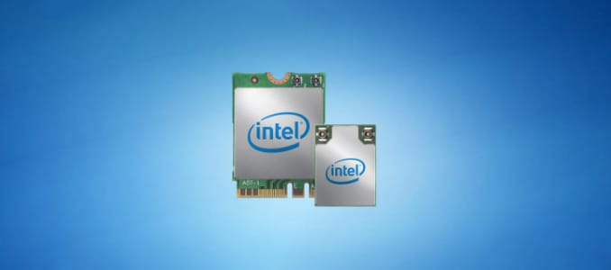
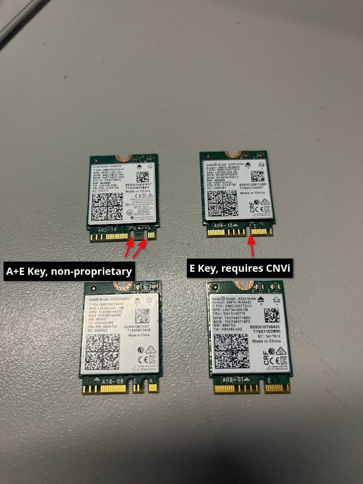

+++
date = '2024-03-15'
draft = false
title = 'Intel WiFi with AMD Processors'
+++

This short post begins with my constant problems with network on my desktop. For a long while it's had issues due to its placement in my house. My room is quite far from the router, and has no Ethernet jack. WiFi drops constantly, so I bought a Ethernet over power line adapter–one of those things that you have 2 of, once at the source and another where you want Ethernet. The problem with these is they can be quite slow. Bleh.

I end up using both, the Ethernet is quite slow, but doesn't drop packets, while the WiFi is (relatively) fast, with the downfall of occasional drops. I just leave both connected and my desktop will fallback when one drops. It works, but its still kinda a shit experience.

Regardless, I tried to swap out the WiFi 5 card that was currently in the device ([Intel 3168NGW](https://www.intel.com/content/www/us/en/products/sku/94854/intel-dual-band-wirelessac-3168/specifications.html)) with a WiFi 6 card ([Intel AX200NGW](https://www.intel.com/content/www/us/en/products/sku/130293/intel-wifi-6-ax201-gig/specifications.html)) was surprised (and extremely frustrated, as swapping the motherboard's internal card required removing it from the case) to find it was not recognized in either the UEFI or the OS. Swapping it out with another identical WiFi 6 card from work, I also was surprised to find it did not work.

After more frustration, time, effort, and swaps than I would like to admit, I've found the issue. It is an [Intel technology called CNVi](https://en.wikipedia.org/wiki/CNVi), which moves the actual "networking logic" off the actual WiFi card and into the chipset or CPU. Since this is proprietary to Intel, this means these WiFi cards do not work at all on AMD systems, and even older Intel processors.

It's actually quite easy to recognize these! Chips requiring CNVi will be keyed with M.2 E, while those that do not require CNVi will be keyed as M.2 A+E.

