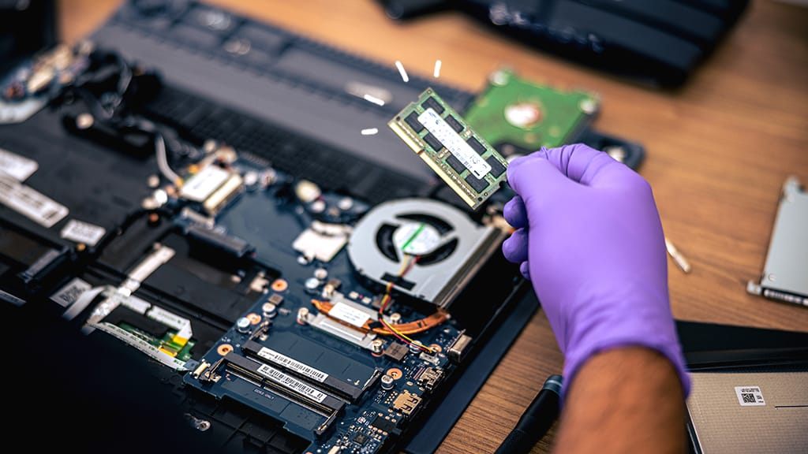
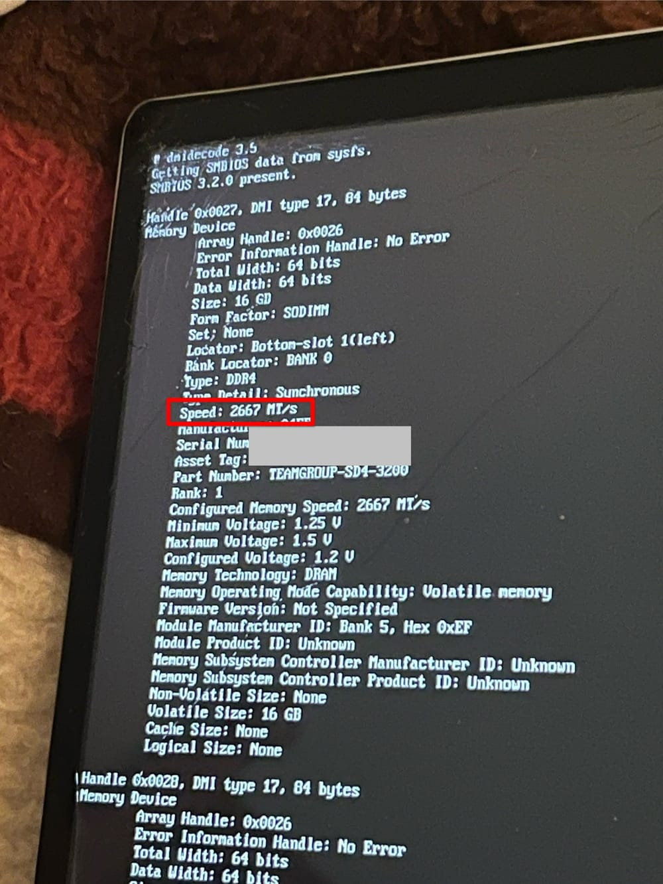
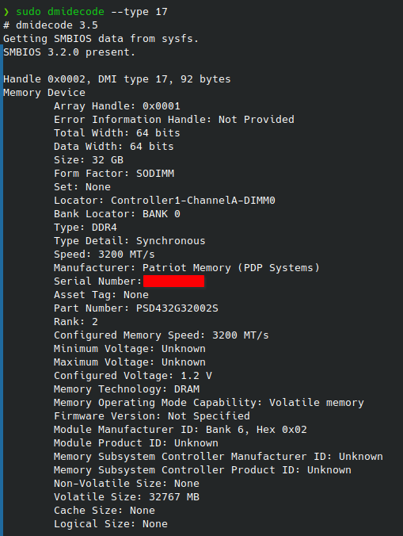

+++
date = '2023-12-28'
draft = false
title = 'Laptop RAM Woes'
+++

Laptop RAM is a pain point for me. I've inexplicably never had a RAM upgrade work right out of the box for a laptop... Maybe I'm just unlucky. I've never had this happen on desktop though.

## Part 1: HP Envy x360

This starts with an [HP Envy x360 Laptop (15m-dr1012dx)](https://support.hp.com/us-en/document/c06449252). The device came with 12GB of DDR4 RAM at 2666MHz. (A 4GB and 8GB stick)

The plan was simple. I bought 2 sticks of TeamGroup 16GB RAM sticks at 3200MHz. ([Amazon Link](https://www.amazon.com/gp/product/B089W6WV3L))

I immediately ran into issues. The laptop would not POST. After some fiddling with it, I ended up swapping the 2 (identical) RAM sticks several times, causing it to randomly boot. OK I guess.

This gets considerably more confusing though. If, at a later date, you remove one of the RAM sticks, and put it back in – The laptop will again not POST. You must perform the swapping of the 2 sticks (I want to again stress, these are identical sticks) an unspecified amount of times, until it will magically POST again.

I'll take partial blame for this, I bought 3200MHz sticks instead of 2666Mhz sticks (The CPU runs the RAM at 2666MHz) I expected it to just run the RAM at the supported lower speed of the CPU. I'm told this is not the case? It did do exactly that anyway. I guess I'll never know if this was the reason for the weird swapping ritual required to POST.

## Part 2: Lenovo E14

My second experience with this is with the [Lenovo ThinkPad E14 Gen 2 (20TA004MUS)](https://www.lenovo.com/us/en/p/laptops/thinkpad/thinkpade/e14-g2/22tpe14e4n2#tech_specs). This device came with a single stick of 16GB 3200MHz RAM. Ideally I could have just plucked the 2 sticks out of my old laptop, and put them in the new laptop. However, in Lenovo's infinite wisdom, they put only a single DIMM.

Knowing the issues I had with my previous laptop, I made sure to get the right speed. I bought a single stick of Corsair 32GB RAM at 3200Mhz. ([Amazon Link](https://www.amazon.com/dp/B09WHB3TY9))

Given I made sure to get the proper speed and what not, I was entirely lost on why this didn't work. [Someone on Reddit had this issue](https://www.reddit.com/r/thinkpad/comments/117jmc4/32gb_ram_on_e14_gen_1/) on an older model, and seemed to resolve it with a different brand.
So I go to Micro Center looking for some Crucial brand RAM, which they didn't seem to have on hand in 32GB DDR4 SODIMM. I ended up buying some Patriot brand RAM ([Micro Center link](https://www.microcenter.com/product/652665/patriot-signature-series-32gb-ddr4-3200-pc4-25600-cl-22-so-dimm-memory-psd432g32002s)) ([Amazon link](https://www.amazon.com/dp/B087WXRH88))

The specs are identical to the Corsair brand RAM, but for whatever reason this works perfectly first try.

I'm not quite sure why this worked with this brand. I can't really do diagnostics on a device that, when inserted causes the machine to not POST.

## Final words

I don't think this is an issue of some brands being better than other brands, as this isn't a problem that (in my experience) exists on desktop. Maybe it has to do with laptop chipsets. I'm not sure. I'd love to see an in-depth investigation in what is going on here.
