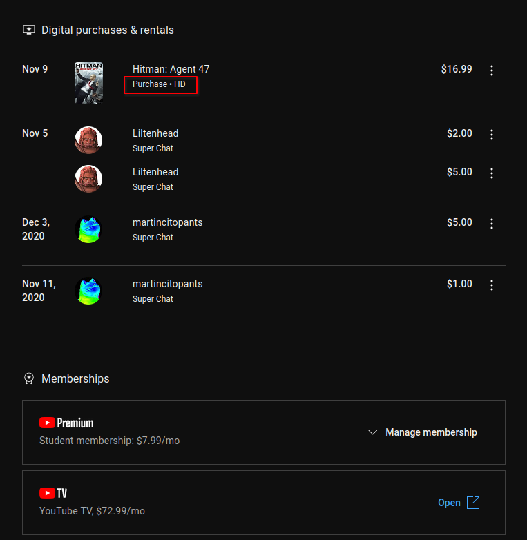
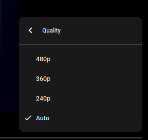
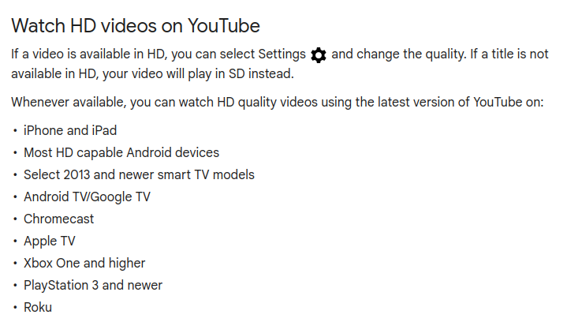

+++
date = '2023-12-25'
draft = false
title = 'I Pirated a Movie I Bought. And You Should Too.'
+++

> I was always willing to be reasonable until I had to be unreasonable.
Sometimes reasonable men must do unreasonable things.
>
> — Marvin Heemeyer

This first started when I went to buy an HD movie. [Hitman: Agent 47](https://www.imdb.com/title/tt2679042/) to be specific. I love the Hitman series. I've bought and played them all on Epic Games.

<!-- markdownlint-configure-file { "MD033": { "allowed_elements": ["iframe"] } } -->  
<iframe src="https://store.steampowered.com/widget/1659040/" frameborder="0" width="646" height="190"></iframe>



The movie trailer, in case you are interested.

Regardless, I bought the movie. I paid the extra to own it forever too!

So now, with my freshly purchased movie, I go to watch it. Except uh-oh... what's this?

Mildly peeved, I go looking in Google's support forums. According to [this support article](https://support.google.com/youtube/answer/3306741?hl=en), watching **legally purchased** movies in full HD is only available on specific devices, of which, browser on PC is not one such device.

Sure, I have the resources to watch it "correctly"... I have an iPhone, an Android TV, Chromecast, Xbox One, Roku, all of that good stuff. Hell, I have a multi-thousand dollar home theater. But that's besides the point – I wanted to watch this on my PC with a friend over Discord. I cannot do that, as my PC has not been graced by HDCP.

At this point, I just want a damned MP4. So, I went and torrented it. And guess what? It just worked. Why is it that a paying customer is having a worse experience than someone who has pirated. I just did both. I have the money to buy and support the creator, but it's so *hard* to do the right thing here.

I'm not stupid. I know this is in place to prevent pirating. I understand the movie industry suffers from piracy at times. As I have said numerous times before, I would pay, and in this case I *did* pay before I pirated it. The big problem here, is that piracy just offers a better experience than buying. Money has nothing to do with it.

I highly suggest watching Louis Rossmann's video on this entire topic. this isn't limited to just YouTube movies.



I wanted to do the right thing. I can't promise I'll buy every movie prior to pirating like I did here though. I learned my lesson here.
