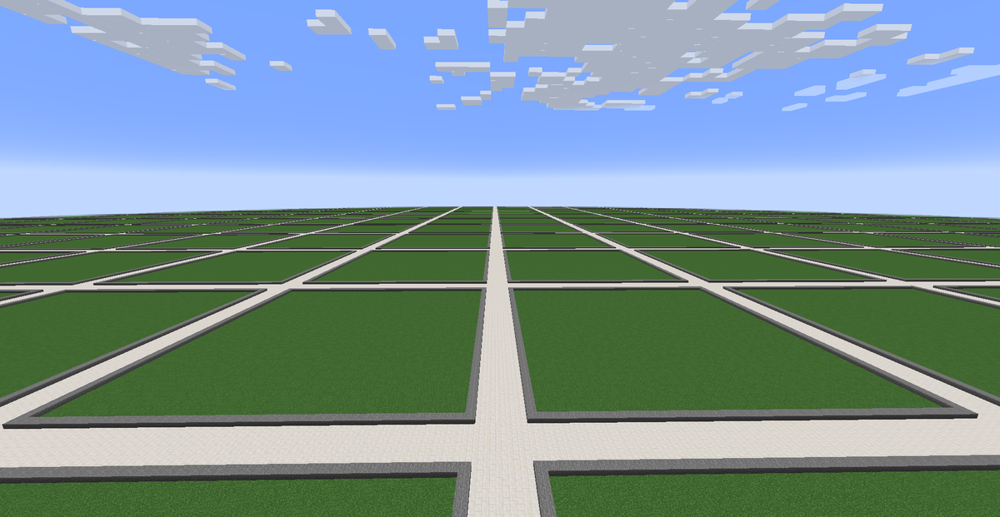
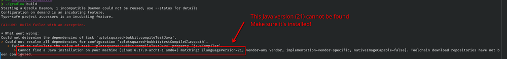
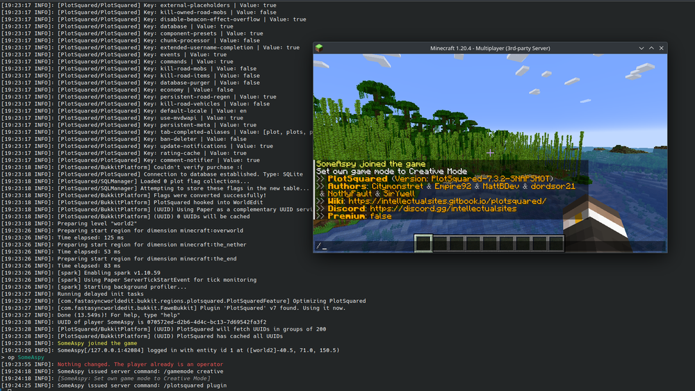

+++
date = '2024-01-08'
draft = false
title = '(Legally) Getting PlotSquared for Free'
+++

I like to help people host small servers, often for free for small friend groups. To me at least, it doesn't make sense to pay the €15 for small servers. ([PlotSquared can be purchased on Spigot](https://www.spigotmc.org/resources/plotsquared-v7.77506/))

**If you are hosting medium to larger sized servers and can afford it, you totally should support the software you use!**

<https://github.com/IntellectualSites/PlotSquared>

Regardless, the choice is up to you. This also allows you to use bleeding edge git builds.

## Prerequisites

- [Java JDK 21](https://adoptium.net/temurin/releases/?version=21&package=jdk) or higher (as of December 2025)
- [FastAsyncWorldEdit](https://ci.athion.net/job/FastAsyncWorldEdit/) plugin installed on the MC server
- [Git](https://git-scm.com/)

## Building

First, you should git clone the repository using the following command:
`git clone https://github.com/IntellectualSites/PlotSquared`
This will download the repository from GitHub, which you should then `cd` into or open.

### If you are on Windows

run `.\gradlew.bat build` within the directory

### If you are on a Unix-based system

run `./gradlew build` within the directory

---

If you get an error, make sure to read it, and Google it.

In the below example, it shows Gradle failing to find Java. This will inevitably happen as this post gets older and PlotSquared gets updates. Just take note of the `languageVersion` variable, this will tell you what version it expects.

---
After running the build command, the PlotSquared jar should be placed in `Bukkit/build/libs/plotsquared-bukkit-X.X.X-SNAPSHOT.jar` or some variant.

Note there will be two other files, ending in `-javadoc.jar` and `-sources.jar` You do not need either of these.

You can then move the `plotsquared-bukkit-X.X.X-SNAPSHOT.jar` into your Minecraft server's plugin folder.

Keep in mind, as indicated by `SNAPSHOT` these are unstable development builds, which you should not expect official support for, especially if you have not bought the paid version.

However, the wiki is free and available for all at <https://intellectualsites.gitbook.io/plotsquared/>

