+++
date = '2024-01-23'
draft = false
title = 'PowerEdge R430 Setup'
+++

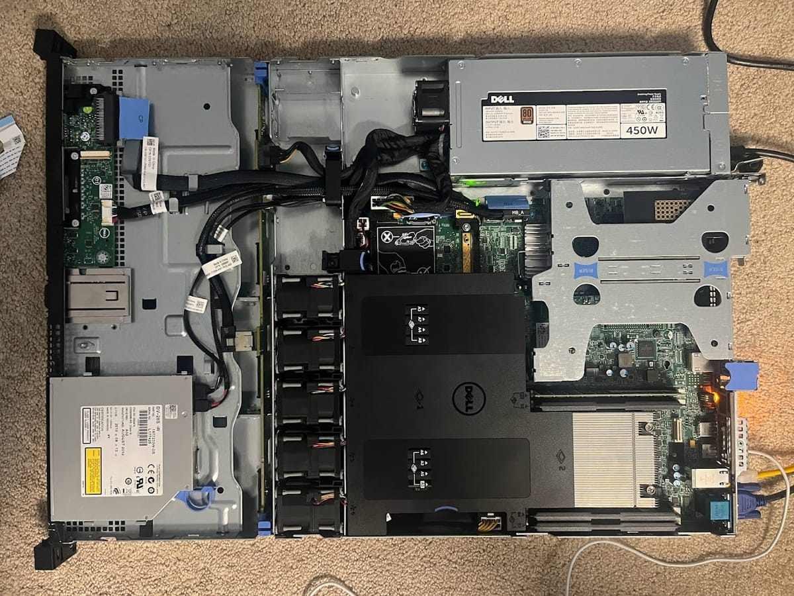

I have recently acquired a PowerEdge R430 from a company called [SpicketRiver Electronics](https://spicketriverelectronics.com/). ([Ebay link](https://www.ebay.com/str/spicketriverenterprise)) I simply cannot recommend them enough. They are the same folks I got the R910 from, and when I had issues with both this server and the R910 their support was simply astounding.

The server costed about $90 USD from them. Upon receiving it, I found a minor issues. the status LCD panel seemed to be shattered, and the DVD drive panel missing, which was not shown in the listing.

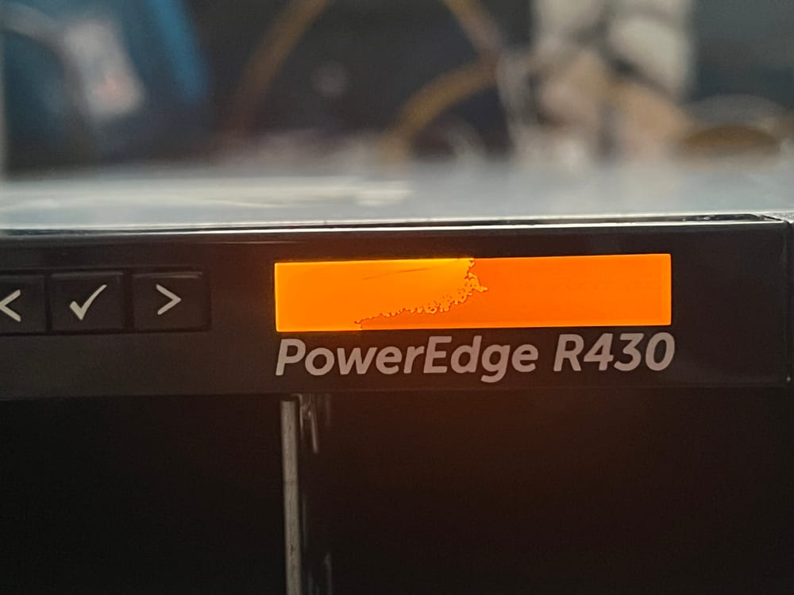

I contacted them with the issue, and within the hour they issued a $20 USD refund to cover the cost of a replacement. As I said, simply amazing support team. Regardless, the part to replace it is quite cheap. ([Ebay listing](https://www.ebay.com/itm/265265169542))

Moving on from the minor issues, everything appeared to work great. It came with no HDD Caddies, and the ones from the R910 do not fit it, as the R910 used 2.5" while this uses 3.5". Caddies seem to go for about $7-ish USD on Ebay, ([Listing](https://www.ebay.com/itm/295772942605)) but I don't really plan to use spinning drives any time soon. I put a PCIe to NVMe adapter in and install Debian.

However, as soon as I reboot, I find Debian cannot boot. Similar to the R910, it cannot (in it's current state) boot an NVMe drive over PCIe. So we move onto the next part, updating the firmware to (hopefully) support this.

I boot into the Lifecycle Controller, and go to the firmware update panel. Dell for many years has served these updates over FTP. However, semi-recently they stopped doing this and moved all the update servers to HTTPS. I assumed this being a newer server would support this, but I was unable to find the HTTPS option. Odd.

After checking the versions, it appears Dell added this functionality in version 2.63.60.61, while the server is on 2.06.05.05. It appears the server was last updated in 2015. In fact, checking the service tag, it appears the manufacture date was 2 days prior to these dates, showing the server was never updated by whoever originally owned it. Classic enterprise moment.

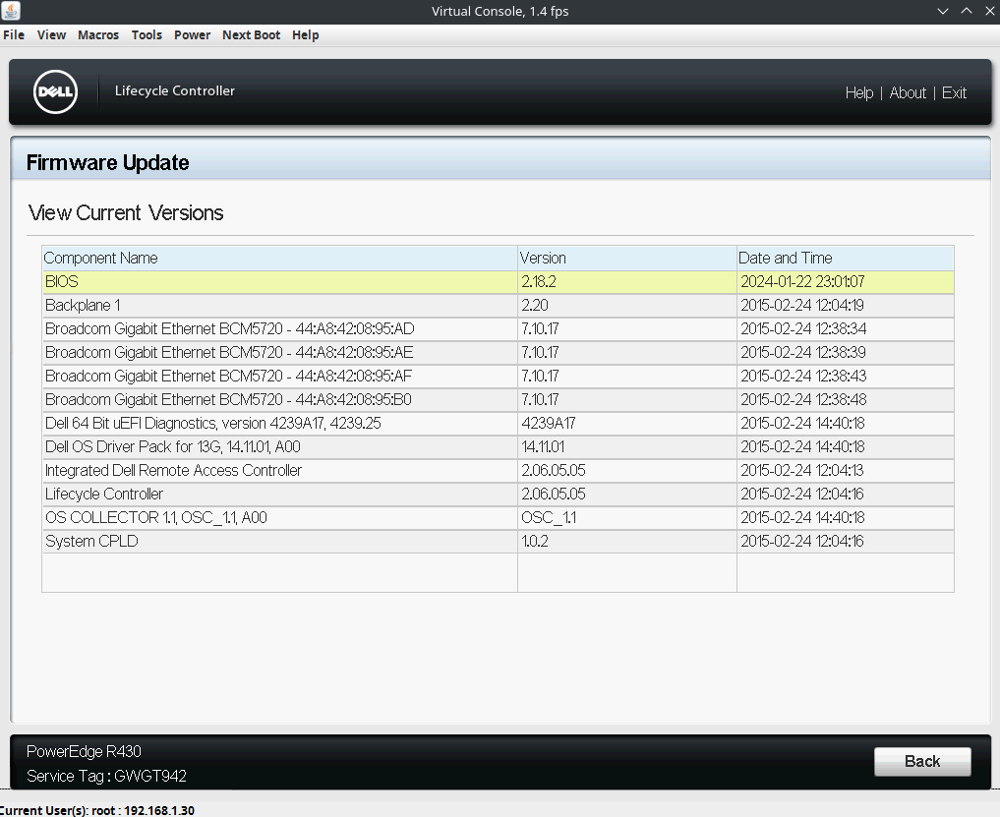

So now we got to update the server. I started with the BIOS (for whatever reason) and it was fairly straightforward. I was able to find the latest BIOS `.efi` file on [Dell's support page](https://www.dell.com/support/product-details/en-us/product/poweredge-r430/drivers), and boot it using Ventoy. The only minor issue I had, was when I clicked to download the file, it displayed it as text in the browser. I kinda assumed it wouldn't work, but I just saved the page using `Ctrl+S` as a `.efi` file and it was fine. I suppose it makes sense there wouldn't be a MIME type for a `.efi` file

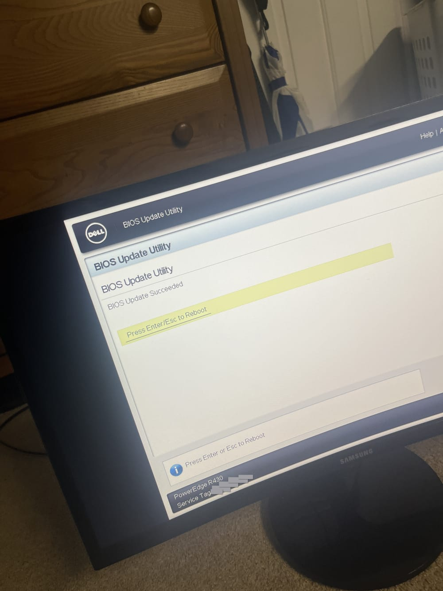

At this point, I decide to update the iDRAC so I can connect to Dell's servers with HTTPS to update the rest of the servers firmware. However, do to the old version installed on the system, I was unable to connect with Firefox.

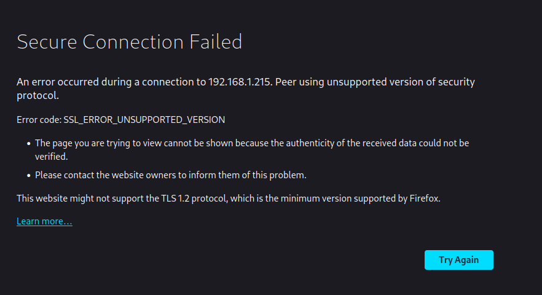

Luckily, this was an easy fix on Firefox, as I could go to `about:config` and just override the minimum required TLS version.

It was moderately more difficult to find the proper files, but I found them on [their own support page](https://www.dell.com/support/home/en-us/drivers/driversdetails?driverid=g79dw). The updater expects them to be formatted as a `.EXE` file for whatever reason. Upon trying to upload the file, I get an error about a missing iDRAC license file.

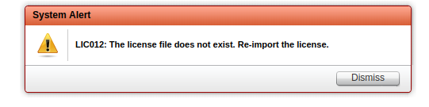

This did not happen with my R910, which included a license. For whatever reason, it seems the license was removed from this server. Dell ships servers with the "Basic" license plan for the iDRAC, which has less features than the "Express" and "Enterprise" plans. However, this server doesn't even have a basic license, so I cannot interact with the iDRAC at all. I have contacted SpicketRiver, however as of writing, it is outside their business hours.
*Update: SpicketRiver has responded they cannot do anything about it, as they received the server like this. In my opinion, this is fair enough.*

On the up side, Dell offers 30 day trials of enterprise licenses, [available on their support page](https://www.dell.com/support/kbdoc/en-us/000176472/idrac-cmc-openmanage-enterprise-openmanage-integration-with-microsoft-windows-admin-center-openmanage-integration-with-servicenow-and-dpat-trial-licenses#TrialLicense-Agreement).

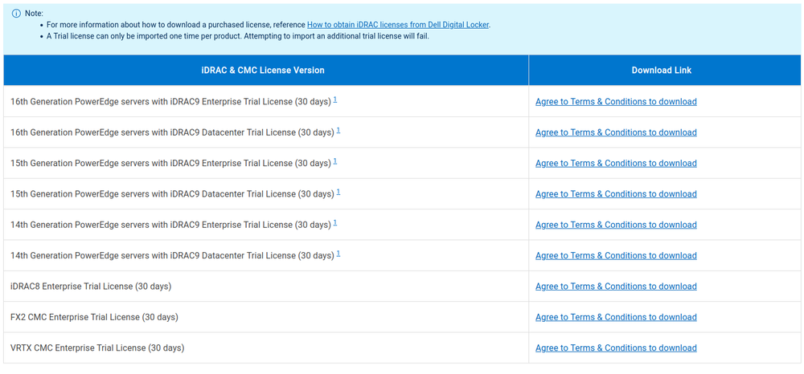

After the 30 days this license will expire and a new trial license will not be able to be activated, but this gives me more than enough time to figure out the license problem. If worse comes to worst, I can just buy one on Ebay, where they go for about $20 USD.

Moving onto actually updating the iDRAC, I find uploading the file takes a lot of time, so much in fact that I assumed it hung at first, but after waiting some time it finished processing.

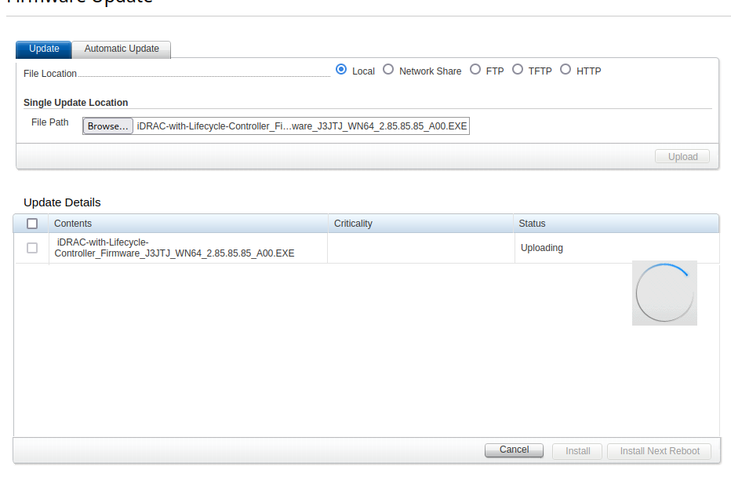

After it uploads, I kinda get stuck for a while as it says:
`RED023: Lifecycle Controller in use. This job will start when Lifecycle Controller is available.`
So I try to log out, I restart the server, Log in, etc. and it still doesn't update. Luckily on the main page I found a small link that says "Reset iDRAC", and it warns me all sessions will be closed, which seems like a good sign.

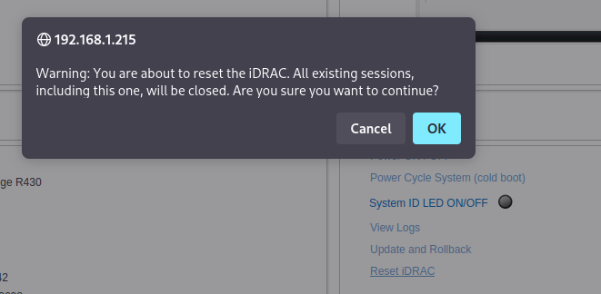

At this point, the fans spin up, and after about a minute they slow down again as the iDRAC reboots. Upon logging in using the [iDRAC6VirtualConsoleLauncher tool from GitHub](https://github.com/gethvi/iDRAC6VirtualConsoleLauncher) (BIG shout out to the owner and developer of this, [gethvi on GitHub](https://github.com/gethvi)) I get a warning that certificates changed, which seems like a good sign. Since I have not yet rebooted the server, I get an error checking versions in the Lifecycle Controller.

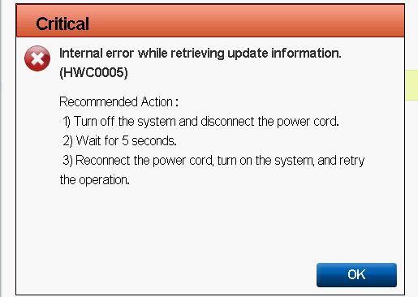

So I issue the command to reboot the server and... It doesn't work. Huh. I tried to reboot the server and reset the iDRAC a few more times with no luck, even completely disconnecting power. It looks like it's time to switch gears.

Instead of downloading the `.EXE` file I boot into Debian live from my Ventoy drive and mount the data partition of the drive which I downloaded the `.bin` version of the updater for Linux from the page mentioned earlier. From the start, it's already looking optimistic.

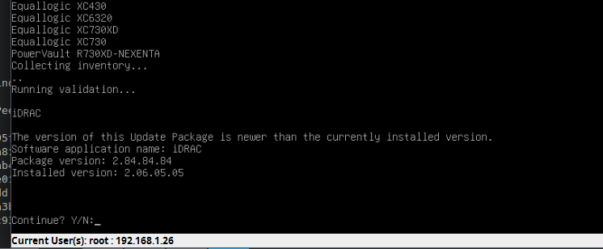

Notably, after the script is done, I can no longer connect using the earlier mentioned iDRAC virtual console launcher tool. Additionally, Firefox is no longer spewing TLS deprecation warnings into the console for every URL loaded from iDRAC. At this point, the TLS requirement can be reset to 3. It looks like in version 2.30.30.30, an HTML5 implementation of the java virtual console was added. Sounds cool!

The HTML5 console can be enabled by going to Overview>Server>Virtual Console and changing the dropdown for Plug-in Type from Native to HTML5. I had to change it to Java first before HTML5 showed up as an option. Once enabled, in the overview, you can click Launch and bring it up.

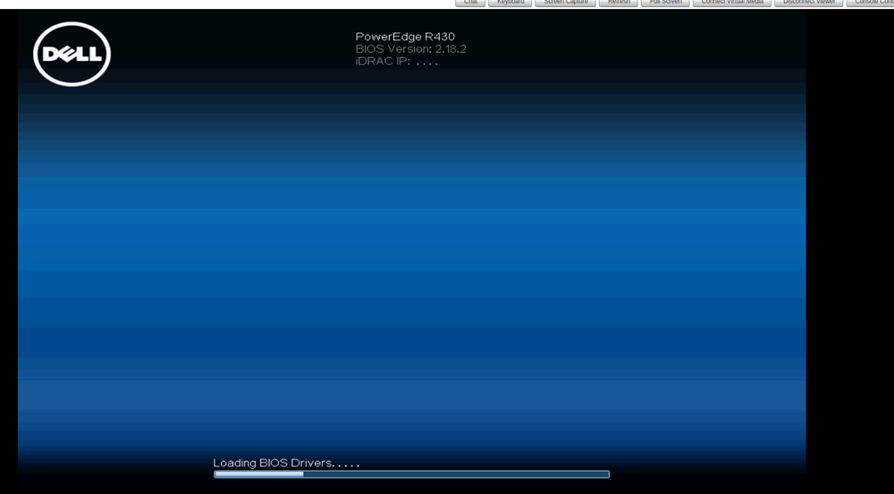

The image is a lot worse, but I suppose it's better than having to use Java... Maybe? I think the Java one was more feature rich, but there is much less latency in the HTML5 version. Maybe I'll make an Electron app for it, because the world just needs more Electron apps *(This is a joke I promise)*

Regardless, we now have the HTTPS update option!

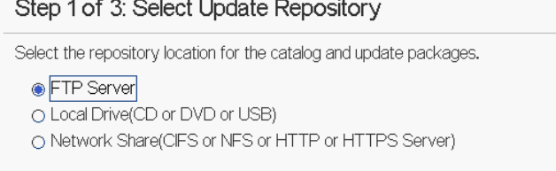

Much easier than having to find all the packages yourself and installing them.

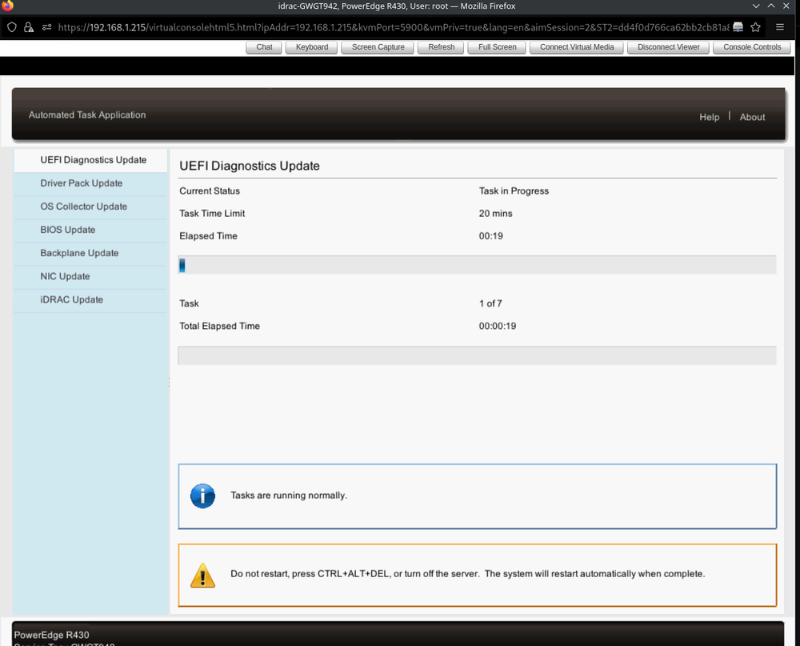

In the end, all that was lost were dates, and my time.

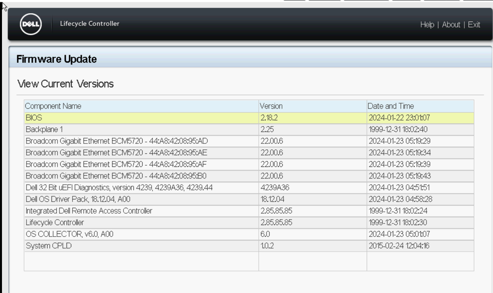

## In conclusion

This could have been done one by one, as I did in the R910 BIOS upgrade post. I think I learned a lot more here than I would have just running the scripts. Additionally, I like just ranting about things I do. This will certainly not be the the last update about this specific server.

*P.S. The NVMe drive still cannot be natively booted by the server. You win some and you lose some.*
