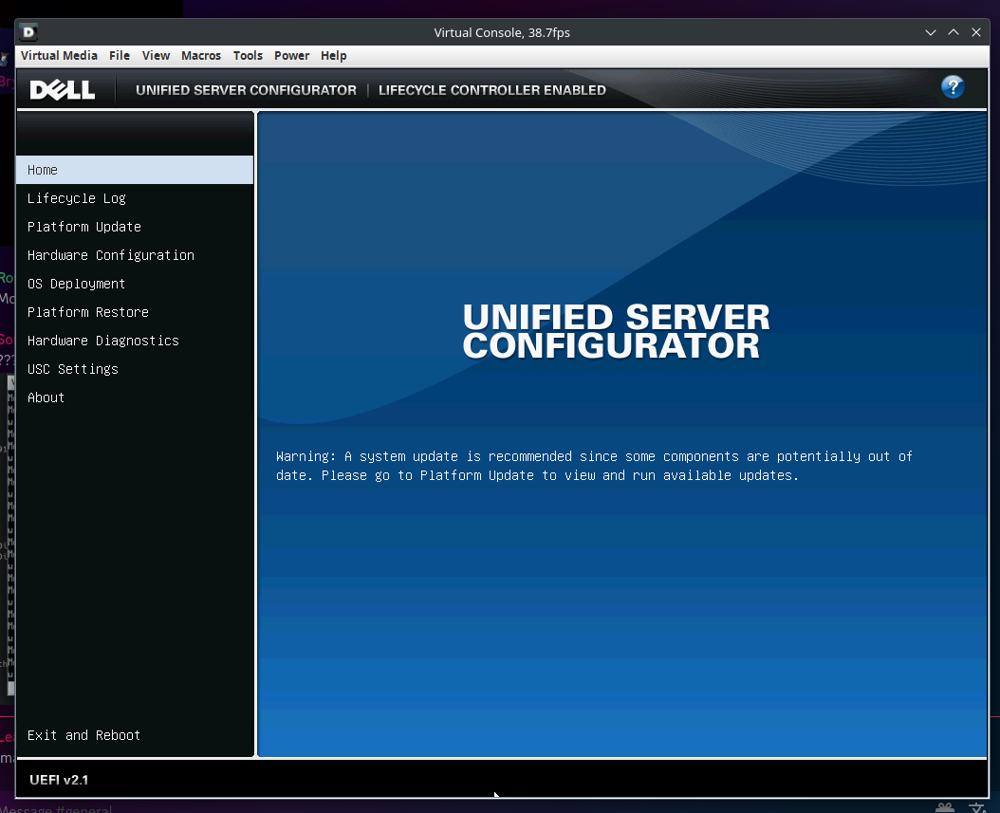
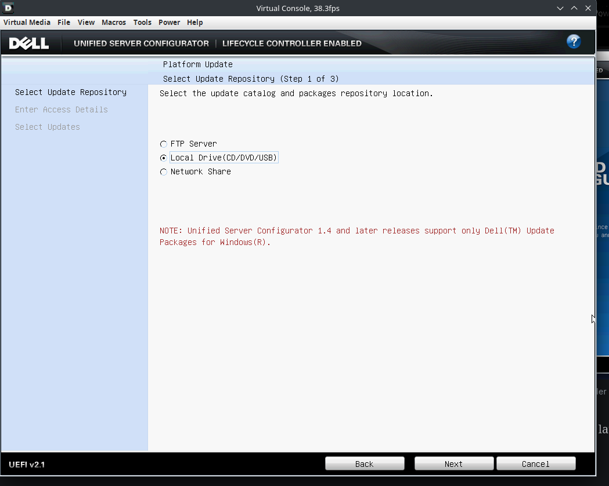
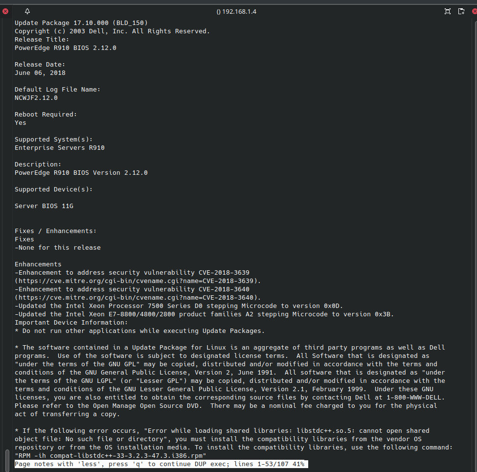
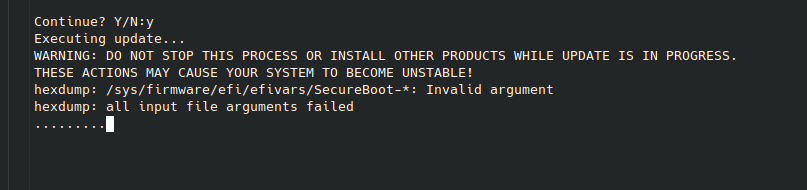
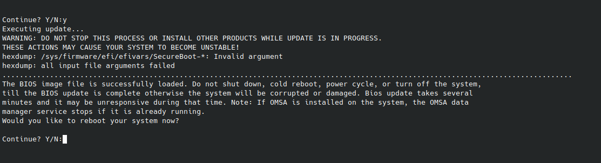

+++
date = '2023-12-01'
draft = false
title = 'R910 Adventures: Updating the BIOS'
+++

I am hoping to begin a series of working on the R910. These articles will range from very short to pretty long. Anyway, Lets get started!

## Getting the BIOS

I have started by creating a USB stick formatted with FAT16, as this appears to be the only format the BIOS updater can read. The BIOS is available at [the Dell Website](https://www.dell.com/support/product-details/en-us/product/poweredge-r910/drivers), and I have downloaded it to the USB and named it `BIOS.exe` (Despite being a Windows executable, this seems to be the file format the updater wants)

## Getting to the updater

To get to the updater, when you get a display output, and given the option in the top right corner, press F11. From there, it should continue the boot process but stop at the boot manager. At the boot manager, select "System Utilities" and then "System Services" and enter "y". The system will then reboot.

Once in the configurator, Go to "Platform Update" and launch the updater.

I selected Local drive, but other options are available. I then selected the USB, and entered `BIOS.exe`, which should be the desired file. There is some sort of verification that goes on (I had it fail on some other files I tried, which I thought were the correct ones)

However, at this point the server started logging errors on the front LCD.

`E171F PCIe fatal error on Bus 0 Device 3 Function 0 . Review & clear SEL`

`E17F PCIe fatal error on Bus 1 Device 0 Function 0 . Review & clear SEL`

I'm not sure whats going on here, but its been frozen for a solid 5 minutes, I press the power button and it shuts down immediately. We are probably gonna have to approach this differently.

Perhaps the issue is one of skipping versions. Navigating around dells site, I was able to find the [oldest download is 2.5](https://www.dell.com/support/home/en-us/drivers/driversdetails?driverid=x8h05&oscode=biosa&productcode=poweredge-r910). The current version the server is on is 2.2, and we were trying to update to 2.12. Hopefully this goes better!

Upon using the linked 2.5 version, a popup appears stating this is not a dell-authorized update.

[There is a bin file available](https://www.dell.com/support/home/en-us/drivers/driversdetails?driverid=ncwjf&oscode=biosa&productcode=poweredge-r910), which is apparently for Linux, and furthermore, it appears it is possible to directly run bin files on Linux, so I'm gonna try that.

Indeed, that does appear to be the correct way to do it.

Upon running the bin file with `sudo bash`, it starts logging output. looking good so far!

The BIOS now seems to be updated.
