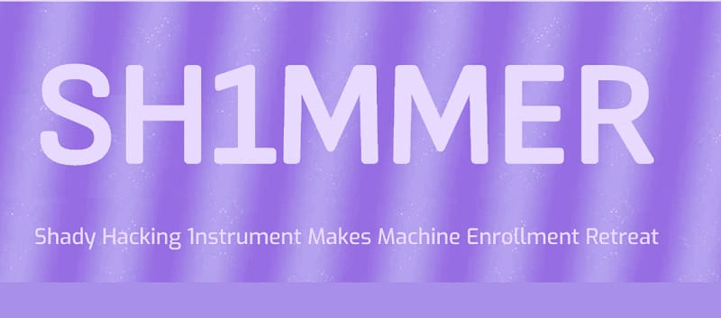
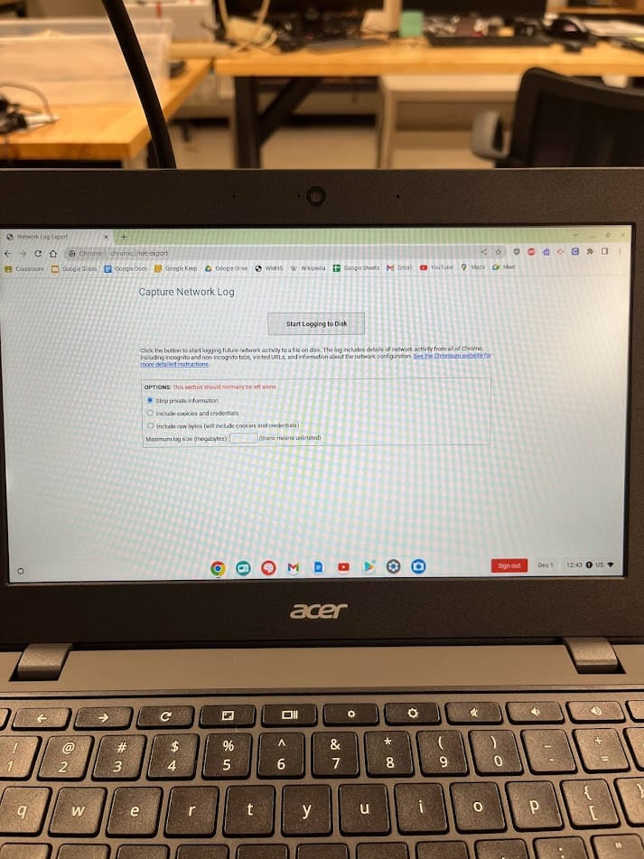
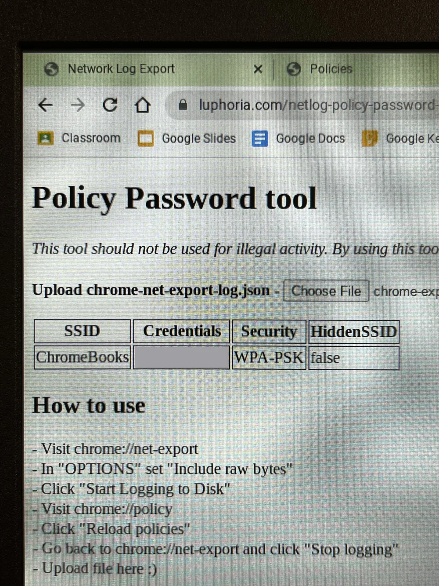
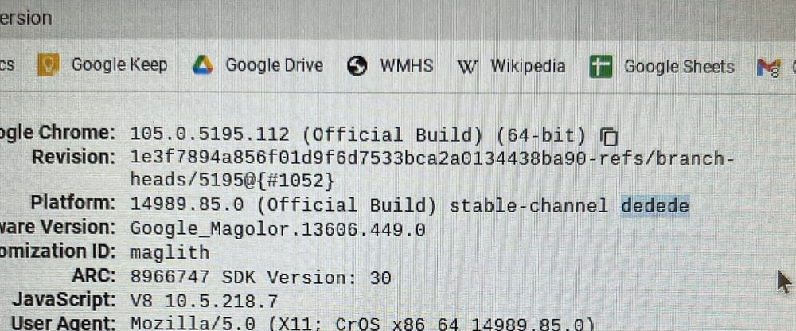
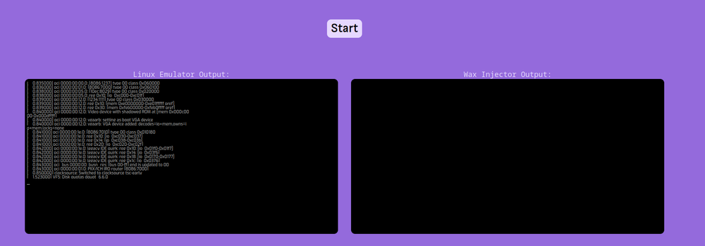
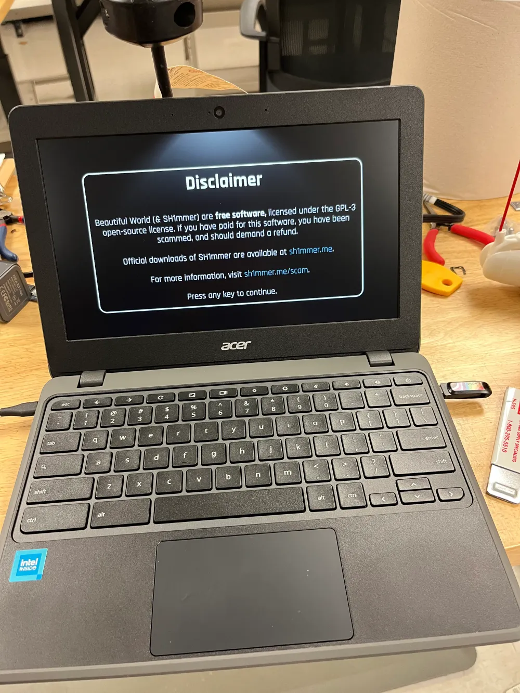

+++
date = '2023-12-01'
draft = false
title = 'SH1MMER: Chromebook unenrollment exploit'
+++



## Warning: Tampering with a device you do not own is a Federal crime. Charges can be pressed

[SH1MMER is an exploit to unenroll Chromebooks from enterprise management.](https://sh1mmer.me/)

Upon investigating, I found it affects the new Chromebooks my district just bought, so this blog will try to detail the process we do to secure them more. It's not perfect, because SH1MMER is a hardware exploit from what I understand, and there are currently only software patches.

There are several ways to approach making it difficult to use the tool, or to use a Chromebook that has been unenrolled.

## Method 1: Update to a patched version

Google has release patches that work to some extent to block the methods SH1MMER uses. The earliest version is 111. However, there are rumors going around in SH1MMER's discord community that there is a new, revamped version of the exploit that will work on versions below 120.

There is also what the SH1MMER community calls ~~"The Fog" which includes devices ranging from 111 to 113.~~ It appears to involve opening the device and disconnecting the battery, so be extra aware of devices coming in with tampering. [There is a specific method detailed on an external site.](https://web.archive.org/web/20240413102136/https://osu.bio/sh1mmer/unpatch)

The Fog is version 112, which prevents the downgrading of ChromeOS to versions prior.

## Method 2: Blocking sites that help

Firstly, once a device is unenrolled, the student will need to connect the device back to the network, if your network passwords are private, they can still be obtained by using chrome://net-export
From the net export, sensitive data can be exported, including WiFi passwords, and then viewed using net-export viewers like [https://luphoria.com/netlog-policy-password-tool](https://web.archive.org/web/20260110074737/https://luphoria.com/netlog-policy-password-tool)

The documentation to [block URLs is here](https://support.google.com/chrome/a/answer/7532419?hl=en), some specific URLs you might want to block are the following:

- <chrome://net-export>
- <chrome://version>

Again, none of this matters if the student has *already* unenrolled the device.

## My Attempt at using this (with permission from the sysadmin)

### Part 1: Getting WiFi passwords from net-export

If I were to be a student, I wouldn't know the WiFi passwords, and would not be able to connect my de-provisioned Chromebook to the WiFi, so first we will attempt to get the passwords using <chrome://net-export>. This, in theory should be version agnostic.

The instructions are quite simple, but are available at the luphoria domain mentioned earlier nonetheless.



First, we go to <chrome://net-export>, select "Include raw bytes" and select "Start Logging to Disk"
Then we go to <chrome://policy> and reload the policies.
After stopping the logging, you upload it to the website (Seems dubious, since this will include credentials and cookies. It doesn't seem to actually make any network requests.)

It does indeed work. It lists the SSID, Credentials, and encryption. It also returns whether the SSID is hidden.
Below that, it also spits out a mix of garbage and readable text, which also included semi-sensitive data.



With the school WiFi passwords now in hand, we can begin trying to de-provision the Chromebook

### Part 2: De-provisioning the device

First, we need to check if the version and board is compatible. Going to <chrome://policy> we can verify this, our current board and version is Dedede with 105. Checking this against the SH1MMER website, we can verify this should be able to work.



~~The shims are available at <https://dl.sh1mmer.me>. However, at time of writing the site is down. I was able to find a download at the web archive, and a faster one at at <https://dl.osu.bio>~~ *(2026: All these links are dead)*

The downloaded file is a .bin file, which needs to be injected into a recovery image. Google seems to have taken down a lot of the original downloads, but it seems people archive it. I was able to find one at ~~<https://osu.bio/sh1mmer/builder>~~. (No longer there) The builder appears to be a Linux script run inside a Linux container on the website, which is undeniably pretty cool. After that finishes it starts downloading quite a large download, which I can only assume is the entire patched recovery image. The download is painfully large and slow, which brings me to the next part.



However, we can also do this process entirely locally. We can do this following [the instructions in the SH1MMER readme](https://github.com/MercuryWorkshop/sh1mmer/tree/beautifulworld?tab=readme-ov-file#building-a-beautiful-world-shim)

```bash
git clone https://github.com/MercuryWorkshop/sh1mmer
cd sh1mmer/wax
wget https://dl.sh1mmer.me/build-tools/chromebrew/chromebrew.tar.gz
sudo bash wax.sh path/to/the/shim/you/downloaded.bin
```

At the time of writing, the entire dl.sh1mmer.me site is down, so I downloaded Chromebrew from the GitHub repository. <https://github.com/chromebrew/chromebrew/releases/tag/0.4.1>

```bash
git clone https://github.com/MercuryWorkshop/sh1mmer
cd sh1mmer/wax
wget https://ia804709.us.archive.org/view_archive.php?archive=/31/items/dl2.sh1mmer.me/dl2.sh1mmer.me.zip&file=dl2.sh1mmer.me%2Fminishim%2Fdedede.bin
wget https://github.com/chromebrew/chromebrew/archive/refs/tags/0.4.1.tar.gz
mv 0.4.1.tar.gz chromebrew.tar.gz
sudo bash wax.sh ./dedede.bin
```

If it worked, the `dedede.bin` file should now be injected with SH1MMER

From there, you need to build a recovery image with it. Using Chrome you can get the [Chromebook Recovery Utility](https://chromewebstore.google.com/detail/chromebook-recovery-utili/pocpnlppkickgojjlmhdmidojbmbodfm?pli=1) otherwise, you can use DD, since the tool is not compatible with Linux. *(2026: [Now you can](https://support.google.com/chromebook/answer/1080595?hl=en#zippy=%2Cstep-download-a-new-copy-of-the-os%2Cuse-a-linux-computer))*

Once the USB is prepared, plug it into the Chromebook, and press the keys to get to recovery mode. From there,  I got "No valid image detected" but the guide says to put the device into developer mode. Doing that, it asks to return to secure mode, since the device is currently provisioned. On this screen, press the keys to get to recovery mode again, and the device should boot into the SH1MMER exploited drive



From the booted device, you can go to utilities and unenroll

From there, the device is reset and you must sign in, and you will not be forced to re-enroll.
The device shows up in Google console as enrolled, so there does not appear to be a way to tell from the sysadmin standpoint.

It can also be re-enrolled using the disk, with again, no changes to the console

Patching this appears to be difficult other than the deterrents
On 119 the method just used does not work.

There are further versions of this that supposedly work (until google makes new keys, which they really should have from the start when there was a leak.) like [E-Halcyon](https://fog.gay/)

I suppose this is it for now, not much you can do, and this is all a massive game of cat and mouse between Google and exploiters. Hopefully Google makes new shims, to replace the leaked ones.

I hope to try later hacks, and have subsequent articles.
