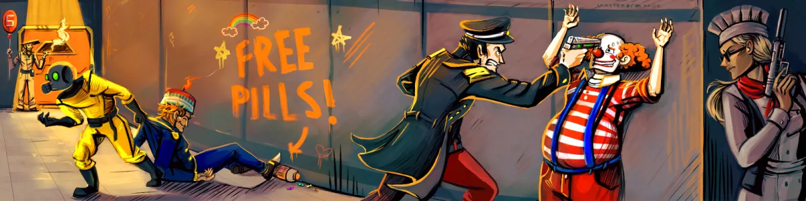

+++
date = '2023-08-29'
draft = false
title = 'SS14: FOSS Gaming on Linux'
+++

Space Station 14 can be compared to Among Us, to someone who has never played, If you thought Among Us was hectic, it is nothing compared to SS14.
Oftentimes, imposters are the least of your concern, and the worst is other players incompetence in running the place.

<!-- markdownlint-configure-file { "MD033": { "allowed_elements": ["iframe"] } } -->  
<iframe src="https://store.steampowered.com/widget/1255460/" frameborder="0" width="646" height="190"></iframe>

## So what is this?

Space Station 14 is a hectic imposter/management game where you take on the role of someone trying to keep a failing station going, all while things are made worse by sabotage or incompetence. There are several roles you can choose from:

### Security

Protect the crew, respond to incidents and keep the station safe. You will be tasked as a space-police officer and assisting the crew with security concerns. These concerns can vary from a clown annoying someone, to a bomb in the medical bay. This role often keeps you on your toes and moving around the station.

### Engineering

Manage the infrastructure of the station, and keep the air in the halls clean via the atmospherics controls. Your duties can vary from fixing a door, to patching a massive hole in the station from a bombing. Oftentimes, you will be called out to make renovations or fix problems often created by... incompetence on other crew member's part.

### Cargo

Manage the economy of the station, deliver and bring in orders, and hunt down item bounties. You will get to pilot the cargo shuttle, interact with almost every department, and search the station for items required for bounties, all while keeping on top of the station balance.

### Science

Perform research to better the station, investigating alien artifacts that explode, materialize monkeys, create rock monsters, or distort gravity around them. This job can be quite dangerous, but rewarding. You will mostly be working from inside the science department, performing various tests on said artifacts, and with this new knowledge inventing things to make the station run better!

### Medical bay

Keep the crew alive from life threatening injuries caused by squabbles, mistakes, sabotage... or just being black out drunk. Whatever it is, you have the supplies to fix them up. Cloning, medication, cyborgs, the whole thing!

### Other jobs

If these jobs don't sound like your cup of tea, there are tons of other things to do. You can cook for the crew being a chef, entertain as a mime or clown, work on mutating plants in botany, clean up as a janitor, or just do nothing and roam around as a passenger, making up things to do as you go

## FOSS gaming is possible

Space Station 14 demonstrates that even without a required payment and uptight internal workings, it is possible to run on a game purely off of the community. While it may not be as large as some communities, it is still enough to thrive in stark contrast to what the current game market looks like- Loot boxes, Battle Passes, Gambling, and other in app purchases. The game thrives off of [donations via Patreon](https://www.patreon.com/spacestation14), and players adding features [via the GitHub Repository](https://github.com/space-wizards/space-station-14).

I recognize this does not work for all games, but if you for free games, it is something that should be taken into consideration, indie developers can offload some of the development onto the community, while still leading the direction their game goes in.

## Linux gaming is important

Most games are not built for Linux at all, More recently that has been changing due to devices like the Steam Deck, which runs a fork of Arch Linux called Steam OS. Valve developed a fork of Wine called Proton to run Windows games better on Linux. While this is a step in the right direction, we should not be relying on translation layers for Linux gaming. This is up to game developers to do when they compile their game for distribution. In some cases (Specific game engines) it is as easy as ticking a box! Yes, yes- This isn't possible for all engines and games, but when it is, the freebie should be taken.
