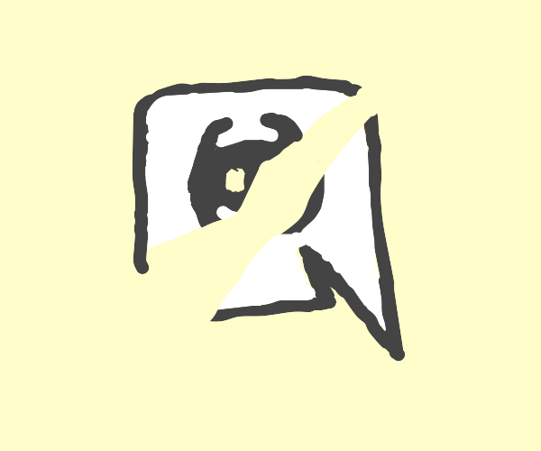

+++
date = '2024-04-04'
draft = false
title = 'Stale Friends'
+++

## As of writing, I have 627 friends on discord. Six. Hundred. Twenty. Seven

One may ask, how can I maintain so many friendships? It's quite simple: I don't. So then why are they still on my friends list?

I have all these friends online, but some I don't even talk to anymore. Haven't talked to in years. Some I've even forgotten and don't recognize.

As with anything, relationships naturally and gradually deteriorate without upkeep. As aforementioned, a few of these people I haven't talked to in years. Do they still like me? Do they still *know* me?

You may ask, "Why not just clear out your friends list?" And that's a valid question. The answer is a bit winded, and hard to explain. I have thought about it quite a bit more recently.

It's hard for me to clear out these "Stale friends" as I've termed it because I just associate good memories and times with them, and I don't think I'm ready to remove my ties with them. Additionally, nothing negative has prompted me to remove them (In most cases) so I just leave them there... to gather dust, and continue to deteriorate and age. It hurts actually. I never meant to abandon them, conversation just kinda died off and never resumed, with time marching on.

I think I'm not the only one with this issue. I look at other friends and see they have mutual friends of people they've had massive arguments and fallout with, and that hate each other's guts. Why didn't they remove each other? Perhaps they fixed things privately, but with what I know about it in the specific case I have in mind I doubt it. It's quite odd.

It makes me feel guilty, like I'm supposed to maintain active conversations with every single one of these 627 people in my computer that I've never even met in-person.
