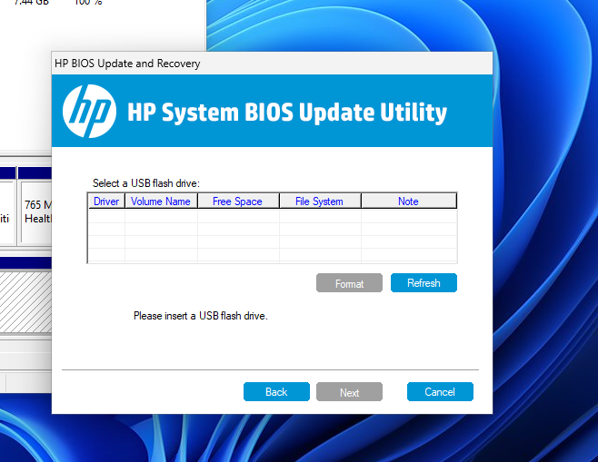
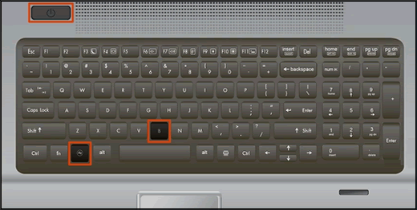
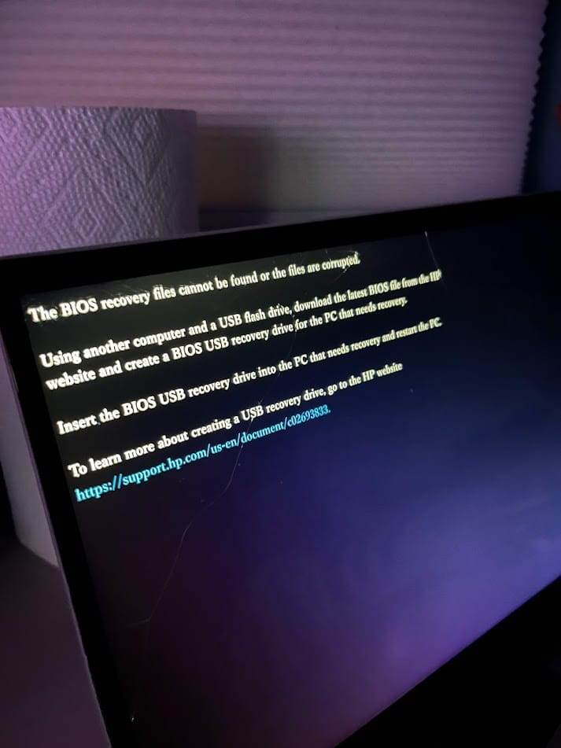
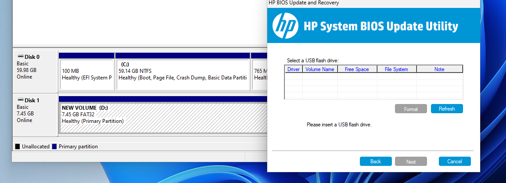
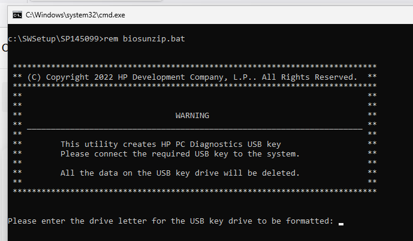
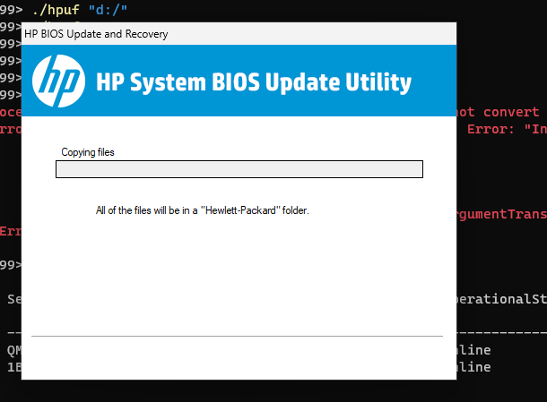
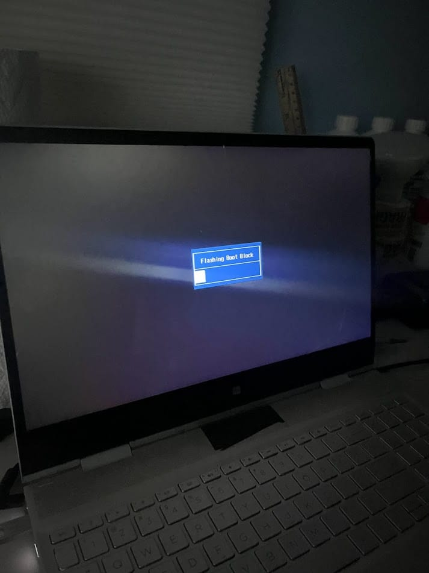
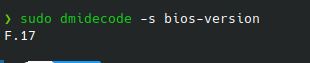

+++
date = '2023-12-03'
draft = false
title = 'Struggling to update an HP BIOS on Linux'
+++

My laptop is an HP Envy x360 DR1012DX - I can't promise this will work on your device.

After only finding a `.exe` as a BIOS update option on the HP driver list for my laptop, I had to find a solution for Linux.

This might be a short post, as I just want to document the way I did it for anyone else that might be struggling to do this.

First, I tried running the executable under WINE, I expected nothing, and got nothing.

Next, I tried to extract the contents with 7-zip. This seemed to work at first, but it spit out another executable called `BIOSUpdate.exe` which could not be further extracted so this turned out to be a dead end.

Lastly, what I'm trying as I write this a method that I found a [bit deeper into HP's website](https://support.hp.com/in-en/document/ish_3932413-2337994-16). It details an prior-undocumented startup key combination, as show below. Makes me wonder how many more secret key combinations there are.

Sure enough, it boots into this strange looking text I have never seen. Luckily, it exits after 15 seconds and boots normally, so this isn't a "no looking back" option

While messing with the BIOS update tool trying to finagle more files out of it, there was an option to make a recovery USB. While it didn't work in WINE, I can spin up a Windows VM and redirect a USB drive to it. Now, I think we are getting somewhere.

I've run into a big problem doing this, the utility will not recognize the flash drive, even though Windows within the VM does. I'm not sure whats going on here.

Upon trying more USB drives, one of them had a FAT partition, which the tool recognized. To make a FAT partition in Windows, the partition must be 4GB or less, so I made a 1GB partition. However, now the utility does again, not recognize it. Frustrating.

Failing to use the update utility once again, in a last ditch attempt, I try to use the HP 4-in-1 recovery USB utility occasionally mentioned around the forums. The only download link I'm able to find is in an HP forum post, so I've linked it here:
([HP FTP direct download](https://ftp.hp.com/pub/softpaq/sp145001-145500/sp145099.exe))

Command line. this looks a lot more reliable. (it was not)

With the command line tool being completely borked (It would attempt to format the drive, and then exit), I turned to the BIOS update utility again - it recognized the drive this time! I'm not sure what changed, maybe it was it being FAT32 preformatted, or maybe it was that the drive was 14GB for the partition. I'm not sure. My setup is as follows here: `1 Kingston 1BC21CB008D9 Healthy Online 14.42 GB MBR`

I wish you luck, but I'm gonna continue.
~~I will include a DD image of the drive, since I had so many issues getting to this point~~ *(2026: This was lost in a server migration)*

It seems to have worked!

And finally, we can confirm it updated from F.15:

And that's all, I hope that helped you!
