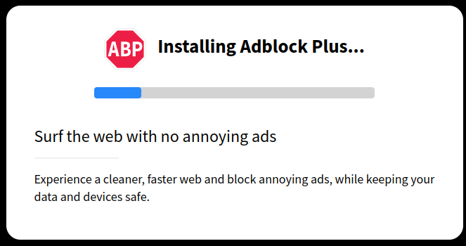
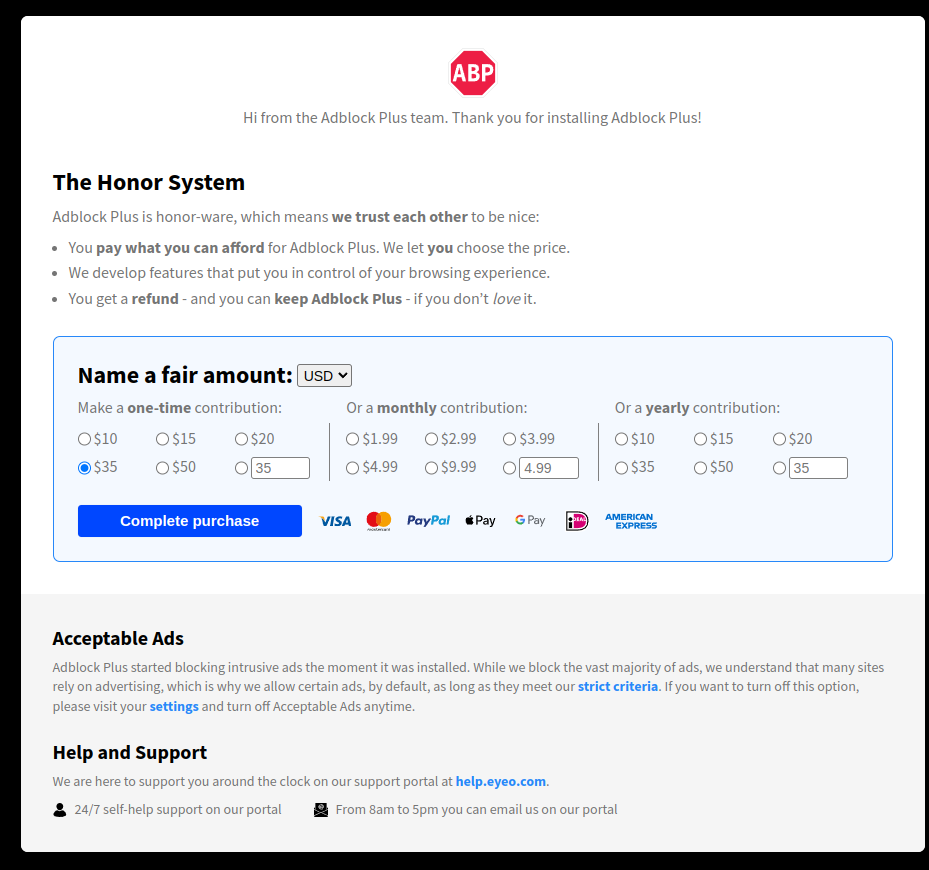
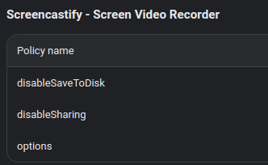
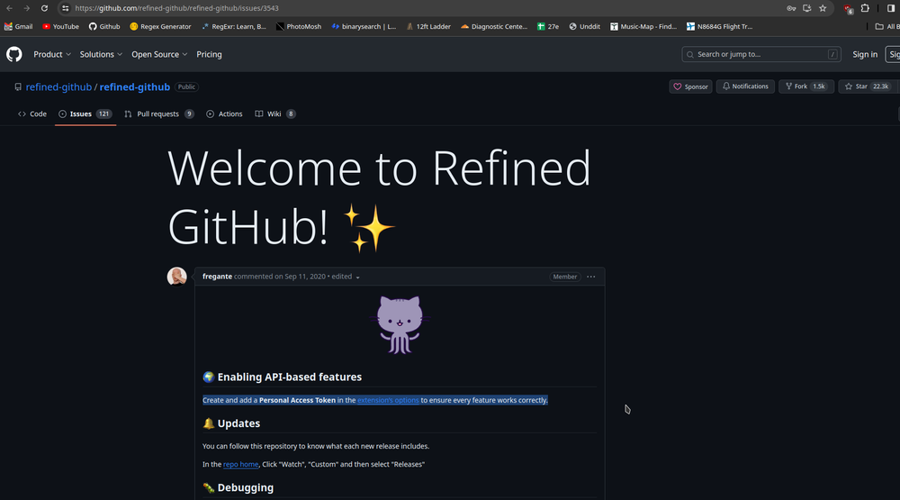

+++
date = '2023-12-08'
draft = false
title = 'The Annoyances of First Run Pages on Extensions'
+++



## Some extensions can justify it, but not many

In my school district, we force deploy [Adblock Plus](https://chromewebstore.google.com/detail/adblock-plus-free-ad-bloc/cfhdojbkjhnklbpkdaibdccddilifddb) to all student and staff devices. We do this because many ads in this day and age can be downright malicious to end users. In addition, they can impede the usage of sites.

While I don't like Adblock Plus for many reasons, (Later post perhaps) this is downright awful on some devices, mainly the ones we have in carts, which reset every time they are closed, to wipe student logins. Standard practice for shared Chromebooks. The issue arises where Adblock Plus has a "first run" page, which runs every time the extension is installed. This page has an [unnecessary loading page](https://www.reddit.com/r/ProgrammerHumor/comments/s60to6/i_made_a_fake_progress_bar_to_shut_up_clients/) (Chrome already handles installing extensions, this is just useless) and after "loading" it then proceeds to beg for donations.



### On a tangent, did you know its Adblock plus is practically useless anyway? [They've been bribed by almost every major advertiser to whitelist their ads.](https://www.businessinsider.com/google-microsoft-amazon-taboola-pay-adblock-plus-to-stop-blocking-their-ads-2015-2)

Now, asking for a donation every now and then is fine, but the problem arises in the fact that this is run on every install, meaning when a student opens a Chromebook, they get hit with a ton of "first run" pages (there is more than one offender here) because Chrome proceeds to install all the user extensions. This is something teachers have complained about a lot because it quite frankly, is annoying.

There is a policy setting to disable it in Adblock Plus, in <chrome://policy>.


Upon looking into how to do this, all we found there was no real official documentation on how to do this, and [the only blog post mentioning blocking the first run page via the registry for Windows.](https://blog.adblockplus.org/development-builds/suppressing-the-first-run-page-on-chrome)
We were not having a lot of luck figuring out on our own, as it's not a toggle switch in the console, it asks for JSON input. We tried a few things similar to `{"suppress_first_run_page":true}` and whatnot, but it was not applying.

```json
{
  "supress_first_run_page": {
    "Value": true
  }
}
```

It caught me totally off guard that there was a `"Value"` requirement, but it worked. Cool! That's one down. There are a few other offending extensions that do this pop-up thing, but I will detail that as we figure out each.


The other extensions are not so easy I suppose, and in the case of [Screencastify](https://chromewebstore.google.com/detail/screencastify-screen-vide/mmeijimgabbpbgpdklnllpncmdofkcpn), there is only an `options` input, which I can only hope has a way to disable the first run page.



## What kinds of things are "proper" uses of a welcome page?

Take [Refined GitHub](https://github.com/refined-github/refined-github), upon installation, you are greeted with the [welcome page](https://github.com/refined-github/refined-github/issues/3543). Why is something like Refined GitHub exempt from my little crusade here? The extension *needs* a GitHub token to perform about a quarter of it's functions.



## The acceptable ads program

It's hard for me to talk about Adblock Plus without mentioning their acceptable ads program, and it is the reason I use [uBlock Origin](https://ublockorigin.com/). I have to admit, its a good idea on paper, but when users install an "ad blocker" they don't expect little footnotes, and there shouldn't really be footnotes in my opinion. It works by charging publishers a fee to have their ads whitelisted. This sounds way too much like bribery to me, and I don't like it. There's a lot more to it, but it's not something I'm interested in other than scratching the surface of it. With that said...

## The best ad blocker for everyone

For both enterprise and end users, I can only really suggest uBlock Origin. It is quite performant, and really just works out of the box.
