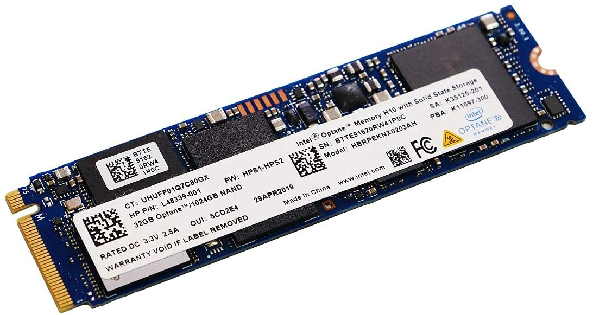

+++
date = '2023-08-27'
draft = false
title = 'The Pains of Optane'
+++

## This is not a guide on how to recover data from Optane, I was never able to figure it out

Now don't get me wrong, Optane seems pretty cool - [coming from the video Intel gives about it](https://www.youtube.com/watch?v=tcKCBwEPXZc). My laptop came with it installed, and I had no issues with it! But when it comes to getting data off it - oh boy... you are in for a treat.

### Whats the background?

The other day at work, our sysadmin's laptop had just gone kaput. The motherboard literally had been charred by a short circuit - yikes! The laptop itself did not boot nor show signs of life, so we removed the drive to put it in another device and disposed of the rest of the dead laptop.

The problem arises when we tried to boot it in another device.

`INACCESSIBLE_BOOT_DEVICE`

Great. Checking the UEFI, the laptop did not see the 512GB that the disk was supposed to be - but a 32GB device. What?
We look at the disk, and sure enough, Optane. According to Intel, both partitions can only be accessed with a 8th gen or higher intel CPU. Interesting. We were using an AMD system so I guess that makes sense? Storage devices shouldn't be locked to a specific brand of processor anyway.

Putting it in one of our Intel laptops, both partitions are recognized in the UEFI. Hooray! We try to boot it but yet again Windows greets us with

`INACCESSIBLE_BOOT_DEVICE`

Now that it's still not working, I decide to boot into a Debian live USB and just rip the data off it. Surely that cannot go wrong, right?

Booting the Debian live USB, both partitions are recognized. Upon attempting to mount the 512GB partition, I get an error stating, the filesystem is not recognized. Weird. this should be NTFS, but its a RAID 1 array of 2 disks on the same disk???? What???

### An explanation (kinda)

Whats going on here? Why all these problems with what should be a standard SSD?

Turns out, Intel Optane is a single NVMe x4 lane drive, split into TWO x2 lanes. This is why it doesn't work on AMD machines. This is not in the NVMe standard. Intel added this proprietary method of Optane. So if the device is not built with Optane in mind, you are at the mercy of how the NVMe standard is implemented on the motherboard. On devices that are not a 8th gen+ motherboard, you oftentimes will only get one of the two situations:

- You only see the 32GB device (Optane itself)
- You only see the 512GB device (The general storage)

This is insane to me. However, I cannot think of a better method of doing this. So whatever. I can't critique them without a better solution in mind.

The second part of this is the RAID array. It is not RAID 1, but some proprietary fork.
Intel Optane operates by accelerating the main drive, or caching files on the Optane device, which is supposedly significantly faster. I'm not sure how RAID is used in this, so I cannot really provide further details.

### So What?

This is why I hate Optane. Its entire premise is accelerating a disk. This makes quite a lot of sense on a spinning hard drive, like you would see with the SHDD, (This was effectively the same thing, but integrated onto a spinning hard drive, and never really caught on)
On an SSD, I don't think this will give the amazing improvements it could if the technology was implemented (cleanly, more like Optane instead of the half assed implementations storage technology companies often came up with)
I can kinda understand the need for a proprietary RAID 1 implementation, as to my knowledge RAID 1 does not have a standard of cache and/or acceleration. So fair I suppose.

### How could my problems be addressed?

Simply put, more documentation and Linux support. I shouldn't have to jump through a million hoops and even then not recover the data. Have a document listing how you can read these drives as external drives.
That's about it.

### On the topic of Intel storage

Most new Intel devices ship in with a single drive, and RAID on, instead of AHCI. This can complicate working with these devices a lot at times, for example, imagining with Macrium Reflect. Intel says that this Intel RST thing they strapped onto the RAID mode makes it faster, but really, please just use the standard.

#### Update 11/23/23

I have found <https://www.amazon.com/dp/B08PV3X6HR> (Model SKUD0402) Effective in reading ONLY the DATA device of Optane hybrid drives. Note, this is with an AMD processor. I'm not sure if you would get different results with an Intel processor.

On the other hand, [MSI's MPG X570 Gaming Plus](https://www.msi.com/Motherboard/MPG-X570-GAMING-PLUS/support) appears to be able to read only the OPTANE device of Optane hybrid drives.

Neither of these will give you full access the the Optane drive, and even with access to DATA drive, you may still be impeded by Intel's custom RAID configuration.
