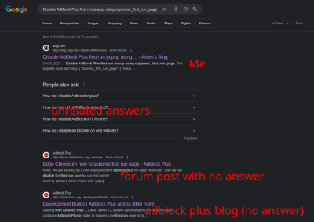
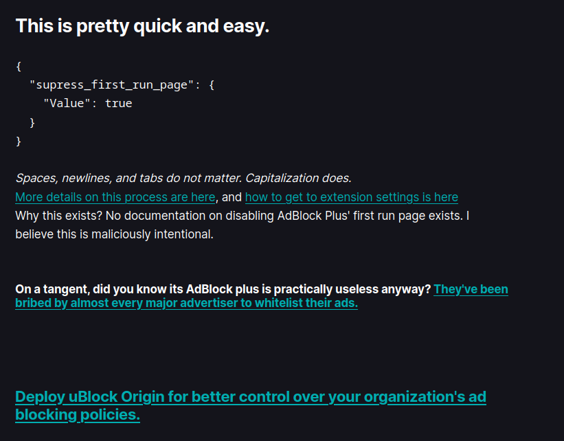

+++
date = '2023-12-28'
draft = false
title = 'What Is This Blog For?'
+++

When I made this blog back in April of 2022, I just used it for random rants, and that is still what I intend to use it for. However, posting on it was a pain as the old one used [Docsify](https://docsify.js.org/#/). Wasn't a problem with Docsify though, as the name implies, its for *documentation*, not blogs. [You can see the old implementation here.](https://github.com/SomeAspy/TheDumpster/tree/main/blog.aspy.dev) At one point I even talked about switching to Ghost in a post, and decided not to. Later down the line, on the 27th of October 2023, I decided to switch to Ghost. No regrets.

Regardless, my intent with this blog can be broken down into 3 main purposes:

1. Rants
2. Search engine optimized short posts (more explanation below)
3. Things I found interesting enough to talk about

I'd like to immediately address the second item of the SEO posts. I write some posts with the intent of them showing up when you search something. As an example, take following article: [**Disable AdBlock Plus first run popup using suppress_first_run_page**](https://blog.aspy.dev/disable-adblock-plus/)

This is obviously pushes on the keywords you might search trying to figure out this problem.

Why I did this? I couldn't find any reasonable results when I was trying to figure this out. So I went ahead and fixed that.

I also made a longer format blog post about it, without the SEO optimizations to boost it to the top of search. However, I made them separate so the SEO optimized one will be straight to the point with extra details linking to official support articles, which is how I like my answers.

This is the other article I made addressing this point, without the SEO optimizations, so I put some more content or "fluff" in it knowing someone probably isn't gonna be skimming this for an answer.

[**The Annoyances of First Run Pages on Extensions**](https://blog.aspy.dev/the-annoyances-of-first-run-pages-on-extensions/)

As for rants, at the time of writing, the Optane rant is probably my favorite.

[**The Pains of Optane**](https://blog.aspy.dev/the-pains-of-optane/)

And for the last category, its kinda just a catch all.

But that's about it!
