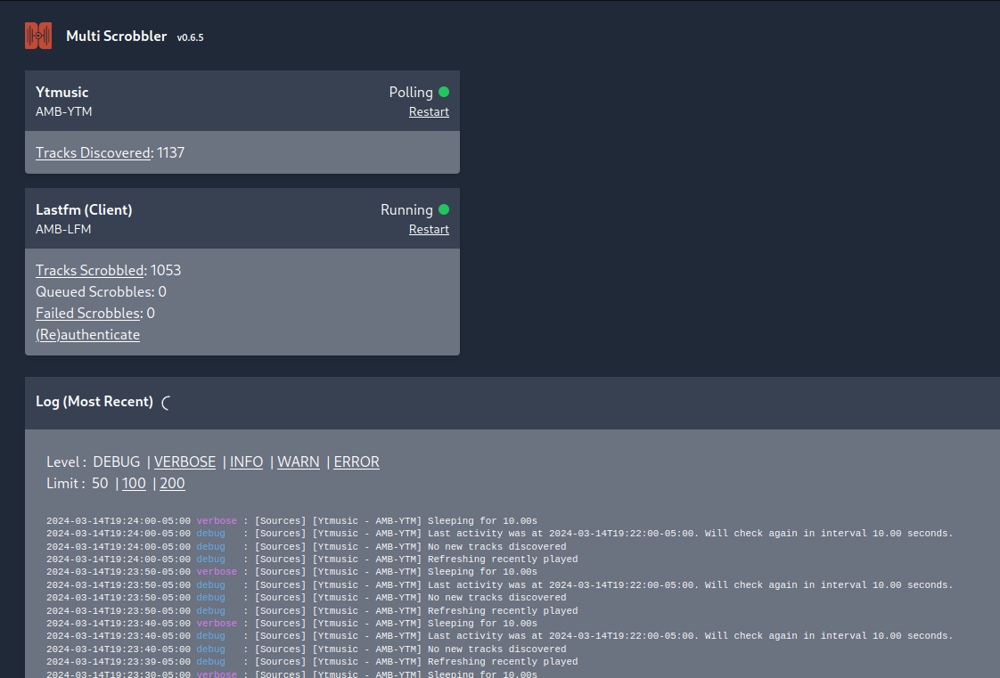
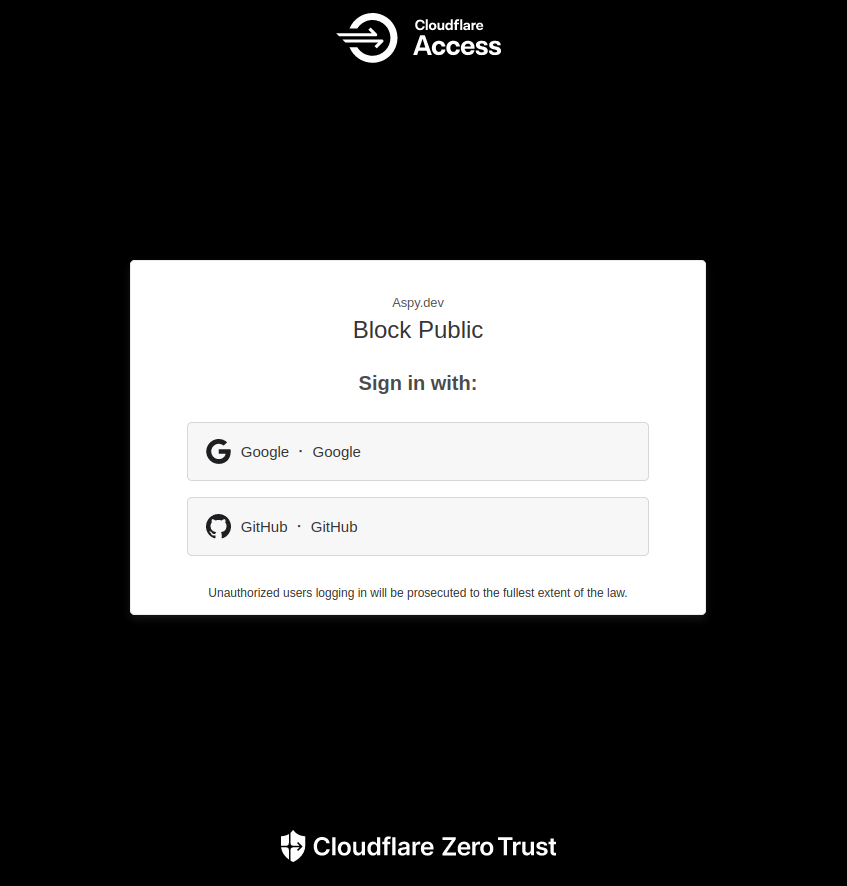

+++
date = '2024-03-14'
draft = false
title = 'YouTube Music Scrobbling on iOS'
+++

## Part 2: <https://blog.aspy.dev/youtube-music-ios-scrobbling-part-2/>

I've been scrobbling to Last.FM for a while from Desktop. Originally using [YTMDesktop from the YTMDesktop org on GitHub](https://github.com/ytmdesktop/ytmdesktop/) I eventually switched to [th-ch's YouTube Music app](https://github.com/pear-devs/pear-desktop), both of which had support Last.FM. However, this left a gaping hole in scrobbling, and that is mobile.

While there are apps to do this for Android (Which I will not list, as I am not an Android user, and don't want to recommend something I don't use) iOS does not have any such apps in the app store. Even if they were available to sideload, Apple makes sideloading a massive pain.

I planned to make my own scrobbler that would operate on a server with an API from Google, but found that Google does not provide YouTube watch history via any API.

After some investigating on the entire topic of scrobbling, I stumbled across [Multi Scrobbler by FoxxMD](https://github.com/FoxxMD/multi-scrobbler), which runs entirely on the server. While it has many options for scrobbling sources, the YouTube Music system uses the user's login cookie to log in as a traditional client and scrape the listening history. Very promising!

Setting it up was quite simple. It has a docker image in both [Docker Hub](https://hub.docker.com/r/foxxmd/multi-scrobbler) and the [GitHub Container Registry](https://github.com/FoxxMD/multi-scrobbler/pkgs/container/multi-scrobbler) with [well written documentation](https://foxxmd.github.io/multi-scrobbler/)!
At first, there were a few issues (namely, incorrectly scrobbling songs again after a session) but I was able to fix this by disabling the system to retry failed requests it (seems to have) fixed the issue. I also ended up using the development image, in an attempt to fix the aforementioned issue.

After setting it up, it runs a small web server to serve a GUI. From here, you can control the scrobbling services and login to Last.FM (Which you will need to [create a developer application for, but it isn't that hard](https://www.last.fm/api))

~~The next problem I ran into is the fact that (in my case) this is a publicly accessible URL. I couldn't just close it, because Last.FM needs to callback URL to authenticate with Multi Scrobbler. I ended up protecting it with [Cloudflare Access](https://www.cloudflare.com/sase/products/access/), which was super simple to setup! I also didn't have to worry about whitelisting the callback URL, as this will only be hit by the client. (which would have to be authorized via CF Access to start the Last.FM authorization flow anyway)~~

## Update 6/14/24

The maintainer of Multi Scrobbler [let me know](https://github.com/FoxxMD/multi-scrobbler/issues/156#issuecomment-2168550525) that the URL doesn't actually have to be public at all, and can even be accessible by only localhost. From what I understand, you only *need* access to the URL for the initial login. Good to know!

Since in my case, I am running this on an external network and server ([Hetzner](https://www.hetzner.com/)) I decided to go with CloudFlare access. but you totally could set up something with Tailscale. (Something I am only recently starting to use)

